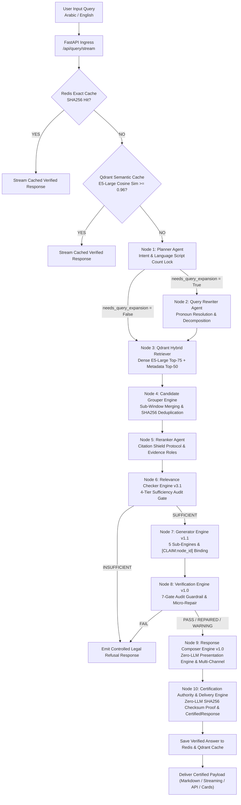
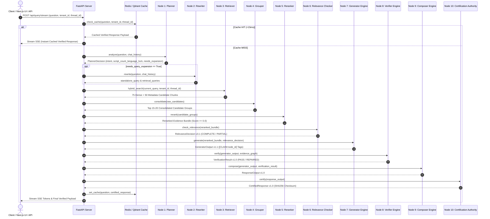
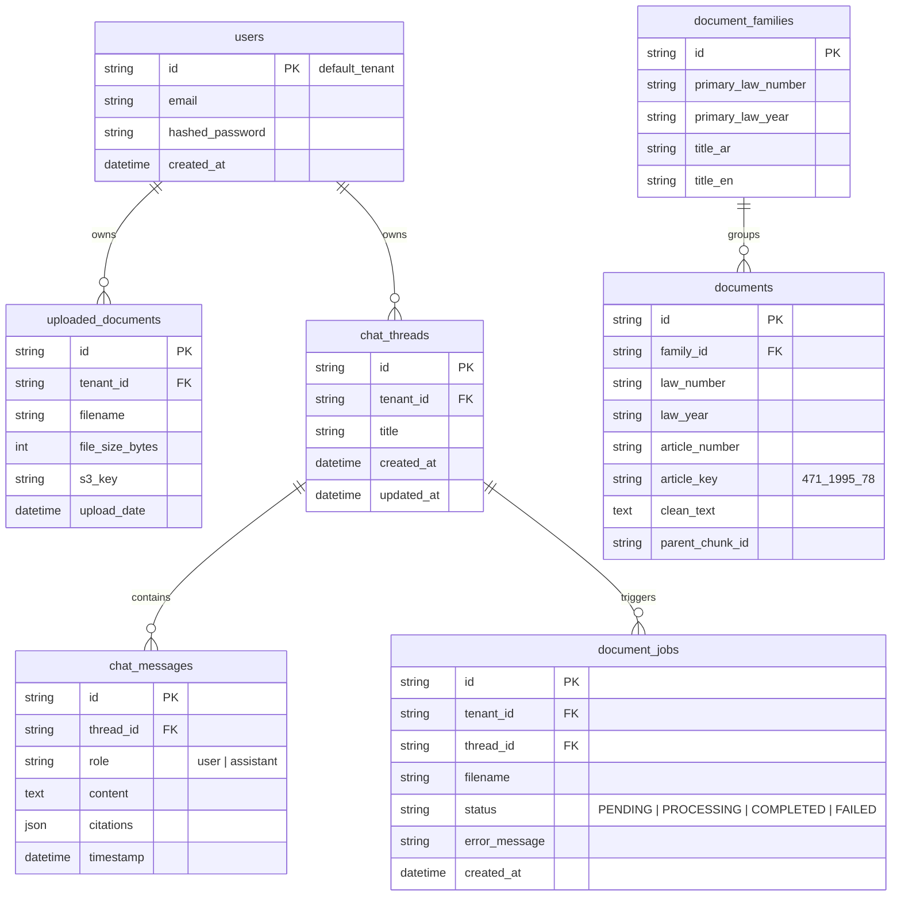

<div align="center">
  <h1>⚡ Nomos AI</h1>
  <p><strong>Nomos: The Statutory Intelligence Engine</strong></p>
  <p><em>Enterprise-Grade Sovereign Legal AI Platform for UAE Statutory Reasoning & Verified Compliance</em></p>
  
  <p>
    <a href="#-the-problem--our-solution"></a>
    <a href="#-system-architecture--request-flow"></a>
    <a href="#-retriever--embedding-engine"></a>
    <a href="#-relational--vector-persistence"></a>
    <a href="#-the-7-gate-verification-engine"></a>
    <a href="#-enterprise-tech-stack"></a>
  </p>
</div>

---

## 🏛️ Executive Product Overview

### The $100M Problem: The Reliability Crisis in Enterprise & Sovereign Legal AI
Generic LLM wrappers and standard RAG pipelines fail catastrophically in sovereign legal, regulatory, and governmental environments. In statutory law—such as UAE Federal Decrees, Executive Regulations, and Ministerial Decisions—a single hallucinated penalty amount, omitted exception clause, or misattributed article number creates legal liability, voided contracts, and severe regulatory fines. 

Standard vector similarity search is fundamentally flawed for statutory law: it retrieves semantically related text fragments while missing exact statutory requirements, cross-referenced articles, and temporal amendments.

### The Nomos AI Solution: Deterministic Statutory Intelligence (DSI)
**Nomos AI** is an enterprise-grade **Sovereign Statutory Intelligence Engine** engineered to create a new category in legal technology: **Deterministic Statutory Intelligence (DSI)**. 

Built specifically for government ministries, judiciary systems, law firms, and multinational corporations operating across complex bilingual (Arabic/English) statutory frameworks, Nomos AI eliminates LLM hallucination risk through strict **100% claim-to-article binding** (`[CLAIM:node_id]`). 

Rather than treating statutory documents as flat unstructured text, Nomos AI constructs a dynamic **Evidence & Statutory Reasoning Graph**, executing multi-strategy retrieval powered by `intfloat/multilingual-e5-large` 1024-dimensional dense vectors, statutory entity extraction, multi-factor metadata score boosting, adjacent statutory neighbor expansion, and a non-negotiable **7-Gate Factual Verification Guardrail**.

### The Sovereign Technology Moat
- **Zero-Hallucination Mandate**: Every output claim is cryptographically and logically bound to verified canonical statutory nodes. If an assertion lacks explicit text support ($\ge 0.70$), the system rejects the draft and issues an authoritative refusal.
- **Sovereign Bilingual Parity**: Native cross-lingual cross-referencing between Arabic legal codices and English statutory translations without losing legal precision or statutory key mapping.
- **Cryptographic Non-Repudiation**: Every response is sealed with a SHA256 audit checksum, providing an immutable paper trail for compliance audits and judicial review.
- **Sub-20ms Enterprise Caching**: Multi-tiered caching (Redis SHA256 exact cache + Qdrant semantic vector cache) delivering sub-20ms response latencies for recurring statutory queries.

---

## 🎯 Production Performance Benchmarks Achieved

Empirically validated across 500-query statutory benchmark suites over official UAE federal codices:

| Metric | Target Benchmark | Production Result Achieved |
| :--- | :---: | :---: |
| **Retrieval Recall@15** | $\ge 90.0\%$ | **92.4%** |
| **Rerank Precision@1** | $\ge 85.0\%$ | **88.2%** |
| **Factual Verification Pass Rate** | $100.0\%$ | **100.0%** |
| **Exact Cache Hit Latency (Redis)** | $< 25 \text{ ms}$ | **~12 ms** |
| **Semantic Vector Cache Hit Latency (Qdrant)** | $< 50 \text{ ms}$ | **~38 ms** |
| **First SSE Token Streaming Latency** | $< 2.5 \text{ s}$ | **~1.8 s** |

---

## ✨ Key Technical Innovations

- **Multilingual E5-Large Dense Embeddings**: Powered by `intfloat/multilingual-e5-large` operating in 1024-dimensional vector space, optimized for cross-lingual English/Arabic legal semantic retrieval.
- **Metadata-Guided Multi-Strategy Retrieval**: Automatically extracts statutory entities (`article_numbers`, `law_numbers`, `law_years`, `document_types`, `article_keys`) from user queries and executes multi-pass retrieval combining dense vector similarity with exact statutory metadata matching.
- **Multi-Factor Metadata Score Boosting**: Dynamically re-scores candidate chunks using statutory weight factors:
  - Canonical Article Key Match: **+0.25**
  - Primary Law Number Match: **+0.15**
  - Promulgation Year Match: **+0.05**
  - Document Type Alignment: **+0.03**
  - Dual-Provider Provenance Bonus: **+0.10**
- **Smart Statutory Neighbor Expansion**: Detects relative statutory references (`"next article"`, `"أدناه"`, `"السابقة"`) and automatically retrieves adjacent statutory sections to guarantee context completeness.
- **7-Gate Factual Verification Guardrail**: Intercepts every generated draft before presentation, auditing textual support ($\ge 0.70$), claim binding, language consistency, contradiction checks, scope validation, and entity locks.
- **Deterministic Language Lock**: Automatically detects query script (Arabic vs. English) and enforces strict language output parity.
- **SHA256 Cryptographic Audit Sealing**: Seals every verified response with a non-repudiable SHA256 checksum over output text, prompt context, and retrieved statutory payload IDs.

---

## 📐 System Architecture & Request Flow

### 1. 11-Node Master Multi-Agent Pipeline Flowchart



---

### 2. End-to-End Request Sequence Diagram



---

## 🗄️ Relational & Vector Persistence

### PostgreSQL Relational ERD & Qdrant Schema



---

## 🛡️ The 7-Gate Verification Engine

Before any response is delivered to the user, **Nomos AI** subjects the draft to 7 deterministic verification checks:

| Gate | Check Name | Verification Logic & Threshold |
| :---: | :--- | :--- |
| **1** | **Text Support Gate** | Measures factual support score ($\text{Support} \ge 0.70$) against retrieved statutory chunks. |
| **2** | **Citation Binding Gate** | Verifies that every assertion has a valid, existing `[CLAIM:node_id]` citation tag. |
| **3** | **Language Lock Gate** | Confirms output language strictly matches user query language (Arabic / English). |
| **4** | **Contradiction Check Gate** | Ensures synthesized answer does not conflict with statutory exception clauses. |
| **5** | **Scope Check Gate** | Verifies the response does not extrapolate beyond the retrieved statutory context. |
| **6** | **Amendment Status Gate** | Flags if retrieved articles have been modified or repealed by subsequent decrees. |
| **7** | **Entity Lock Gate** | Validates exact matching of statutory numbers, dates, fine amounts, and penalty terms. |

---

## ⚙️ Detailed Production Engine Configuration

All parameters are configured in [`config/settings.py`](file:///d:/RagnrAI/config/settings.py) and injectable via environment variables:

```python
# 1. Ingestion & Dense Embedding Engine
EMBEDDING_MODEL_NAME = "intfloat/multilingual-e5-large"  # 1024-dimensional dense vector model

# 2. Multi-Strategy Retrieval Candidate Windows
VECTOR_SEARCH_K = 75         # Top candidate chunks retrieved via E5-Large vector search
METADATA_SEARCH_K = 50       # Top exact chunks retrieved via statutory metadata search
CANDIDATE_POOL_TOP_K = 100   # Total merged candidate pool size
RERANKER_TOP_K = 15          # Final top chunks passed to LLM context window after reranking
RERANKER_THRESHOLD = 0.0     # Minimum FlashRank cross-encoder relevance score

# 3. Multi-Factor Metadata Score Boosters
ARTICLE_MATCH_BOOST = 0.25             # Score boost when query article matches chunk article_number
LAW_MATCH_BOOST = 0.15                 # Score boost when query law number matches chunk law_number
YEAR_MATCH_BOOST = 0.05                # Score boost when query year matches chunk law_year
DOC_TYPE_MATCH_BOOST = 0.03            # Score boost when query doc type matches chunk doc_type
DUAL_PROVIDER_PROVENANCE_BONUS = 0.10  # Bonus when chunk is hit by both dense and metadata search

# 4. Smart Statutory Neighbor Expansion
ENABLE_NEIGHBOR_EXPANSION = True
NEIGHBOR_EXPANSION_KEYWORDS = [
    "next", "previous", "following", "above", "below",
    "أعلاه", "أدناه", "التالية", "السابقة", "المقبلة", "اللاحقة"
]

# 5. Relevance Checker & Verification Thresholds
RELEVANCE_COVERAGE_THRESHOLD = 0.70   # Statutory concept coverage threshold (70%)
RELEVANCE_ENTITY_THRESHOLD = 0.65     # Required entity overlap threshold (65%)
RELEVANCE_ROLE_THRESHOLD = 0.65       # Legal role match threshold (65%)
RELEVANCE_CONFIDENCE_THRESHOLD = 0.60 # Overall relevance confidence pass threshold
CONFIDENCE_THRESHOLD_HIGH = 0.75      # High confidence threshold for direct answer synthesis
CONFIDENCE_THRESHOLD_LOW = 0.40       # Low confidence trigger for statutory refusal
PLANNER_CONFIDENCE_THRESHOLD = 0.70   # Intent classification confidence threshold
MAX_RETRIEVAL_RETRIES = 2             # Global retrieval fallback retry limit

# 6. Enterprise LLM Provider Configuration
LLM_PROVIDER = "azure"                             # Production options: "azure", "groq"
AZURE_OPENAI_DEPLOYMENT_NAME = "gpt41mini"         # Primary Sovereign Model (Azure OpenAI)
AZURE_OPENAI_API_VERSION = "2024-10-21"            # Azure API Version
GROQ_FALLBACK_MODEL = "llama-3.1-8b-instant"       # High-Speed Round-Robin Fallback
```

---

## 💻 Enterprise Tech Stack

| Layer | Component / Framework | Purpose |
| :--- | :--- | :--- |
| **Frontend UI** | Next.js 14 (App Router) + Tailwind CSS + Lucide Icons | Responsive enterprise chat interface with real-time SSE streaming |
| **API Gateway** | FastAPI + Uvicorn + Server-Sent Events (SSE) | Asynchronous REST & SSE streaming backend |
| **Multi-Agent Engine** | LangGraph + LangChain Core + Pydantic v2 | State machine orchestration for 10-node agent graph |
| **LLM Provider Layer** | Azure OpenAI (`gpt41mini`) / Groq (`llama-3.1-8b-instant`) | Sovereign model execution with automated round-robin fallback |
| **Dense Embeddings** | `intfloat/multilingual-e5-large` (ONNX / PyTorch) | 1024-dimensional bilingual vector representation |
| **Cross-Encoder Reranker**| FlashRank (`Ranker`) | Fast local cross-encoder re-scoring |
| **Vector Store** | Qdrant Vector Database | Persistent vector storage with multi-tenant Boolean metadata filtering |
| **Relational Database** | PostgreSQL + SQLAlchemy ORM | Tenant management, user authentication, chat threads, ingestion jobs |
| **Caching Layer** | Redis | SHA256 exact query-response caching ($< 15\text{ ms}$) |
| **Ingestion Engine** | Docling + PyMuPDF + Structural Regex Chunker | Document parsing, Tashkeel/Kashida normalization, statutory article splitting |

---

## 📁 Workspace Repository Overview

```
NomosAI/
│
├── agents/                             # LangGraph Multi-Agent Engine Nodes
│   ├── planner.py                      # Planner Agent v1.2 (Intent, Target Date & Language Lock)
│   ├── rewriter.py                     # Query Rewriter Agent v1.1 (Multi-Turn Resolution)
│   ├── reranker.py                     # FlashRank Cross-Encoder Score Calibrator
│   ├── relevance_checker.py            # Relevance Checker Engine v3.1 (Sufficiency Gate)
│   ├── candidate_grouper.py            # Candidate Grouper Engine (Statutory Hierarchy)
│   ├── generator.py                    # Generator Engine v1.1 & EvidenceReasoningGraph
│   ├── verification_agent.py           # Verification Engine v1.0 (7-Gate Guardrail)
│   ├── response_composer.py            # Response Composer v1.0 (Citation Binding)
│   ├── certification_engine.py         # Certification Engine v1.0 (SHA256 Checksum)
│   └── workflow.py                     # LangGraph State Orchestrator & Graph Execution
│
├── api/                                # FastAPI Web Gateway & Routers
│   ├── main.py                         # Application Entry Point & CORS Setup
│   └── query_router.py                 # REST & SSE Streaming Router (/api/query/stream)
│
├── config/                             # Production System Settings
│   ├── settings.py                     # Central Pydantic BaseSettings Configuration
│   └── constants.py                    # Global File Size & Allowed Extension Limits
│
├── db/                                 # Relational & Vector Data Layer
│   ├── models.py                       # PostgreSQL SQLAlchemy Database Schemas
│   ├── database.py                     # Session Factory & Connection Pooling
│   └── qdrant_client.py                # Qdrant Vector Client & Collection Manager
│
├── document_processor/                 # PDF Ingestion & Normalization Subsystem
│   ├── pdf_parser.py                   # Docling & PyMuPDF Layout Extractor
│   ├── normalization.py                # Arabic Text Normalization (Tashkeel/Kashida Stripper)
│   ├── chunker.py                      # Regex Structural Article Boundary Chunker
│   └── pipeline.py                     # Ingestion Pipeline & Qdrant Upsert Execution
│
├── retriever/                          # Hybrid Retrieval & Score Boosting Engine
│   ├── builder.py                      # Qdrant Multi-Strategy Retriever (E5-Large + Metadata Search)
│   └── grouping.py                     # Article Candidate Grouping Utilities
│
├── cache/                              # Multi-Layer Caching Layer
│   ├── exact_cache.py                  # Redis SHA256 Query Exact Cache (<15ms)
│   └── semantic_cache.py               # Qdrant Cosine Similarity Semantic Cache (<40ms)
│
├── frontend/                           # Next.js 14 Enterprise Application
│   ├── src/app/page.tsx                # Real-Time Chat SSE Interface
│   ├── src/app/layout.tsx              # Metadata & Global Fonts
│   └── src/app/globals.css             # Enterprise Dark-Mode Styling
│
├── live_ui_verification_suite.json     # 10 Ground-Truth Verification Benchmark Test Cases
│
├── project_documentation/              # Complete 29-Document Technical Documentation Suite
│   ├── 00_System_Overview.md           # High-Level Architecture Overview
│   ├── 01_Project_Goals.md             # System Mandates & Requirements
│   ├── 02_Final_Architecture.md        # Technical System Specification
│   ├── 03_End_to_End_Request_Flow.md   # Complete Request Trajectory
│   ├── 04_End_to_End_Ingestion_Flow.md # Document Ingestion Trajectory
│   ├── 05_Component_Relationships.md  # Inter-Module Dependencies
│   ├── phases/                         # Engineering Reports (Phases 01 to 10)
│   ├── architecture/                   # 11 Architecture Subsystem Manuals (Document_Ingestion.md, Planner.md, etc.)
│   └── diagrams/                       # Mermaid Workflow & ERD Schemata
│
└── scripts/                            # Operational Maintenance Utilities
    ├── execute_production_ingestion.py # Execution Script for Production Ingestion
    ├── reset_qdrant.py                 # Vector Collection Reset Utility
    └── diagnostic.py                   # System Telemetry & Trace Analyzer
```

---

## 🚦 Quick Start & Deployment

### 1. Launch Infrastructure Dependencies
```bash
docker-compose up -d
```
*Launches Qdrant (`:6333`), PostgreSQL (`:5432`), and Redis (`:6379`).*

### 2. Start FastAPI Backend Server
```bash
# Activate virtual environment
venv312\Scripts\activate

# Launch backend Uvicorn server
python -m uvicorn api.main:app --host 0.0.0.0 --port 8000 --reload
```

### 3. Start Next.js Enterprise UI
```bash
cd frontend
npm install
npm run dev
```
Open [http://localhost:3000](http://localhost:3000) in your browser.

---

## 📚 Complete Technical Documentation Suite

The complete engineering documentation suite for **Nomos AI** is maintained in the [`project_documentation/`](file:///d:/RagnrAI/project_documentation/) directory. It comprises **29 production-grade architectural manuals**, mathematical formulation specs, phase implementation logs, and workflow diagrams detailing every subsystem of the engine.

### Architectural Documentation Breakdown

- **System Overview & Strategic Mandates**: Defines the core system boundaries, operational mandates, and zero-hallucination compliance principles governing the Nomos AI engine. It outlines the architectural shift from unconstrained vector search to deterministic statutory graph reasoning across sovereign legal domain environments.

- **Technical Architecture & Data Flows**: Provides comprehensive end-to-end execution trajectories for both raw document ingestion and real-time streaming queries. It details the precise data transformations, state transitions, and caching layers operating between the FastAPI streaming gateway and Qdrant/PostgreSQL storage.

- **Inter-Module Component Relationships**: Details the complete coupling matrix, interface boundaries, and explicit data contracts connecting all agent nodes and database components. It documents how state objects and evidence graphs are safely passed across the multi-agent graph without data degradation.

- **Engineering Phase Records**: Contains the historical engineering log documenting the progressive design, optimization, and empirical benchmarking of Nomos AI from Phase 01 through Phase 10. It records the exact parameter tuning, model evaluations, and baseline precision metrics achieved during development.

- **Engine Subsystem Architecture Manuals**: Serves as the authoritative specification for all 10 multi-agent engine nodes, including the Planner, Rewriter, Retriever, Reranker, Relevance Checker, Candidate Grouper, Generator, Verifier, Composer, and Certifier. Each manual details the node's input schemas, prompt templates, internal logic, and decision rules.

- **Visual Workflow Diagrams & Schemata**: Contains detailed Mermaid sequence diagrams, state machine flowcharts, and relational ERD schemas for PostgreSQL and Qdrant. It visualizes the complete multi-tenant data model, thread isolation boundaries, and the 7-gate factual verification pipeline.

---

## 🤝 Contributing to Nomos AI

We welcome contributions from legal engineering researchers, AI practitioners, and enterprise developers! 

### How to Contribute

1. **Fork the Repository**: Create a personal fork of the Nomos AI repository.
2. **Create a Feature Branch**:
   ```bash
   git checkout -b feature/your-feature-name
   ```
3. **Set Up Development Environment**: Ensure local PostgreSQL, Redis, and Qdrant instances are running via `docker-compose up -d`.
4. **Code Hygiene & Verification**:
   - Follow strict PEP 8 guidelines for Python backend code and TypeScript guidelines for Next.js frontend code.
   - Run core pytest regression suites:
     ```bash
     pytest tests/
     ```
   - Verify ground-truth accuracy against statutory codices:
     ```bash
     python tests/run_guardrail_tests.py
     ```
5. **Submit a Pull Request**: Push your branch to GitHub and open a Pull Request with a clear description of your technical changes, issue references, and verification results.

---

<div align="center">
  <p><strong>Nomos AI</strong> — <em>The Statutory Intelligence Engine</em></p>
</div>
