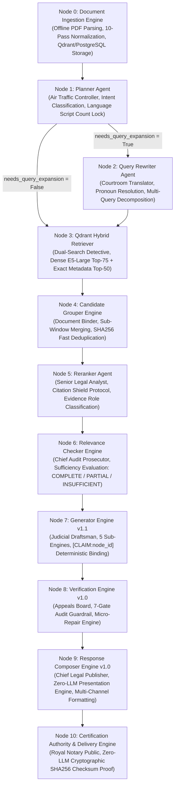

# Nomos AI Production System Overview

## 1. Executive Summary

**Nomos AI** is an enterprise, production-grade **Government Legal Agentic Retrieval-Augmented Generation (RAG) Platform** engineered specifically for authoritative statutory reasoning over United Arab Emirates (UAE) federal laws, ministerial decrees, and executive regulations.

Unlike generic RAG implementations that perform simple vector similarity searches over fragmented chunks, Nomos AI enforces a **zero-hallucination, 100% grounded deterministic multi-agent pipeline** operating across **11 Modular Nodes (`Node 0` to `Node 10`)**. The system converts raw legal codices into relational statutory evidence graphs, executes hybrid dense/sparse vector retrieval with strict multi-tenant metadata filtering, evaluates retrieval evidence sufficiency via a dedicated Relevance Engine, synthesizes claims bound to canonical article nodes, and validates every generated claim against a 7-gate factual verification guardrail before issuing SHA256 audit-certified responses.

---

## 2. Target Domain & Core Guarantees

- **Closed Sovereign Legal Corpus**: Operating strictly over official UAE legal codices (e.g. Federal Law No. 43 of 1992, Ministerial Decision No. 471 of 1995, Federal Law No. 21 of 1995, etc.).
- **Bilingual Script Security**: Native support for Arabic and English queries with dynamic language lock via Unicode script count detection (`Planner.md`).
- **Factual Grounding Guarantee**: Every single legal assertion must map to an explicit statutory evidence node (`[CLAIM:node_id]`). Unsupported or hallucinated assertions trigger automatic verification rejection or disclaimer enforcement.
- **Cryptographic Audit Provenance**: Every certified response produces a verifiable SHA256 checksum, document provenance tree, token telemetry metric, and stage-by-stage latency profile (`Certification.md`).

---

## 3. Technology Stack

| Layer | Component / Technology | Specification & Role |
| :--- | :--- | :--- |
| **API Web Server** | FastAPI (Python 3.12, Uvicorn) | High-performance async web framework providing REST & Server-Sent Events (SSE) streaming endpoints. |
| **Agentic Framework** | LangGraph & LangChain | Stateful multi-agent workflow orchestration with PostgreSQL checkpointer support. |
| **Primary Vector DB** | Qdrant Vector Database | Vector engine hosting dense embeddings (`intfloat/multilingual-e5-large` 1024d) and exact metadata payload indices. |
| **Relational Database** | PostgreSQL (SQLAlchemy & Psycopg3) | Relational persistence for multi-tenant users, chat threads, messages, ingestion jobs, and document metadata. |
| **Caching Layer** | Redis & Qdrant Vector Cache | SHA256 Exact Query Cache (Redis, 24h TTL) + Cosine Vector Similarity Semantic Cache (Qdrant, 0.96 threshold). |
| **LLM Provider** | Azure OpenAI (GPT-4o / GPT-4o-mini) | Primary LLM inference engine configured with `temperature=0.0` for maximum factual adherence. |
| **Embedding Models** | `intfloat/multilingual-e5-large` | 1024-dimensional dense multilingual embeddings for high-precision legal semantic search. |
| **Document Processing** | Docling, PyMuPDF, Struct-Regex | Advanced layout-aware PDF parsing, table extraction, and 10-pass Arabic structural normalization. |
| **Frontend Interface** | Next.js 14, TailwindCSS, React | Modern, rich web application interface supporting real-time SSE streaming, thread history, and citation overlays. |

---

## 4. Master 11-Node Pipeline Trajectory (`Node 0` to `Node 10`)

---

## 5. Master Architecture Node Directory

| Node # | Manual Link | Subsystem Name | Key Responsibility & Role |
| :---: | :--- | :--- | :--- |
| **Node 0** | [`Document_Ingestion.md`](file:///d:/RagnrAI/project_documentation/architecture/Document_Ingestion.md) | **Document Ingestion Engine** | Offline PDF parsing, 10-pass Arabic normalization, article chunking, Qdrant/PostgreSQL storage. |
| **Node 1** | [`Planner.md`](file:///d:/RagnrAI/project_documentation/architecture/Planner.md) | **Planner Agent** | Entry orchestrator, intent classification, Unicode script count language lock, strategy routing. |
| **Node 2** | [`Query_Rewriter.md`](file:///d:/RagnrAI/project_documentation/architecture/Query_Rewriter.md) | **Query Rewriter Agent** | Resolves pronouns (`it`, `this`), prevents hallucinations, decomposes comparison prompts into sub-queries. |
| **Node 3** | [`Retrieval.md`](file:///d:/RagnrAI/project_documentation/architecture/Retrieval.md) | **Qdrant Hybrid Retriever** | Concurrent dual retrieval (Dense $K=75$ via `Distance.COSINE` + Exact Metadata $K=50$). |
| **Node 4** | [`Candidate_Grouper.md`](file:///d:/RagnrAI/project_documentation/architecture/Candidate_Grouper.md) | **Candidate Grouper Engine** | Consolidates sliding sub-windows sharing `article_key` and executes SHA256 hash deduplication. |
| **Node 5** | [`Reranker.md`](file:///d:/RagnrAI/project_documentation/architecture/Reranker.md) | **Reranker Agent** | Assigns `CandidateEvidenceRole` stickers, enforces Citation Shield Protocol, filters threshold $\ge 0.0$. |
| **Node 6** | [`Relevance_Checker.md`](file:///d:/RagnrAI/project_documentation/architecture/Relevance_Checker.md) | **Relevance Checker Engine** | Quality gatekeeper evaluating evidence completeness (`COMPLETE`, `PARTIAL`, `INSUFFICIENT`). |
| **Node 7** | [`Generator.md`](file:///d:/RagnrAI/project_documentation/architecture/Generator.md) | **Generator Engine v1.1** | Executes 5 sub-engines, builds `EvidenceReasoningGraph`, generates draft with `[CLAIM:node_id]` tags. |
| **Node 8** | [`Verification.md`](file:///d:/RagnrAI/project_documentation/architecture/Verification.md) | **Verification Engine v1.0** | 7-Gate audit guardrail (`ClaimGrounding`, `CitationValidation`, `Contradiction`) & Micro-Repair Engine. |
| **Node 9** | [`Response_Composer.md`](file:///d:/RagnrAI/project_documentation/architecture/Response_Composer.md) | **Response Composer Engine** | Zero-LLM deterministic presentation engine rendering markdown, SSE streaming, and Teams/Slack output. |
| **Node 10** | [`Certification.md`](file:///d:/RagnrAI/project_documentation/architecture/Certification.md) | **Certification Authority** | Zero-LLM cryptographic SHA256 checksum proof generator issuing `CertifiedResponse v1.0`. |
