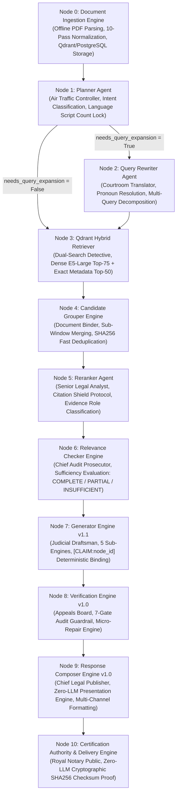

# Nomos AI Production Final Architecture

## 1. High-Level Architecture Overview

Nomos AI uses a **stateless API web layer**, **distributed multi-layer caching**, **vector and relational storage engines**, and an **11-Node master agentic pipeline (`Node 0` to `Node 10`)**.



---

## 2. Shared Agent State Schema (`AgentState`)

The entire multi-agent pipeline communicates through a single, immutable-by-convention LangGraph state dictionary (`AgentState` defined in `agents/workflow.py`).

```python
class AgentState(TypedDict):
    # Core User Inputs
    question: str
    tenant_id: str
    thread_id: str
    chat_history: List[Dict[str, str]]
    
    # Preprocessing & Intent Outputs
    planner_decision: Dict[str, Any]      # Intent, date, domain, language, strategy
    current_query: str                    # Standalone rewritten query string
    retrieval_queries: List[str]          # Multi-query expansion list
    
    # Evidence & Retrieval Payload
    documents: List[Document]             # Retrieved & reranked statutory chunks
    retrieval_trace: Dict[str, Any]       # Dense/exact timing & score trace
    
    # Agent Decisions & Evidence Graphs
    relevance_result: Dict[str, Any]      # Sufficiency level, coverage, failure taxonomy
    candidate_groups: List[Dict[str, Any]]# Grouped statutory document sub-windows
    generation_artifacts: Dict[str, Any]  # GeneratorOutput & EvidenceReasoningGraph
    verification_result: Dict[str, Any]   # 7-Gate verification report & scores
    
    # Final Certified Output & Telemetry
    response_output: Dict[str, Any]       # ResponseOutput (answer, citations, warnings)
    certified_response: Dict[str, Any]    # CertifiedResponse (SHA256 checksum & audit)
    turn_status: str                      # 'success', 'refusal', 'fallback'
```

---

## 3. Master 11-Node Pipeline Decomposition

### Node 0: Document Ingestion Engine (`document_processor/processor.py`)
- **Manual**: [`Document_Ingestion.md`](file:///d:/RagnrAI/project_documentation/architecture/Document_Ingestion.md)
- **Role**: Offline layout-aware PDF parsing (Docling/PyMuPDF), 10-pass Arabic statutory text normalization, article boundary extraction, sliding-window chunking (500 tokens with 100-token overlap), relational PostgreSQL metadata persistence, and Qdrant 1024d vector payload indexing.

### Node 1: Planner Agent (`agents/planner.py`)
- **Manual**: [`Planner.md`](file:///d:/RagnrAI/project_documentation/architecture/Planner.md)
- **Role**: Entry orchestrator, intent classification, Unicode script count ratio language lock (`arabic_char_count / total_chars`), and query expansion routing (`needs_query_expansion`).

### Node 2: Query Rewriter Agent (`agents/query_rewriter.py`)
- **Manual**: [`Query_Rewriter.md`](file:///d:/RagnrAI/project_documentation/architecture/Query_Rewriter.md)
- **Role**: Resolves conversational pronouns (`it`, `this`), incorporates chat history, prevents hallucinations, and decomposes multi-topic queries into independent sub-queries. Includes internal `_semantic_judge()` feedback loop.

### Node 3: Qdrant Hybrid Retriever (`retriever/builder.py`)
- **Manual**: [`Retrieval.md`](file:///d:/RagnrAI/project_documentation/architecture/Retrieval.md)
- **Role**: Concurrent dual retrieval:
  - **Dense Vector Search**: Top-75 candidates via `intfloat/multilingual-e5-large` 1024d embeddings (`Distance.COSINE`).
  - **Exact Metadata Search**: Top-50 candidates querying Qdrant payload indices (`law_number`, `law_year`, `article_number`, `article_key`).
  - **Smart Statutory Neighbor Expansion**: Merges adjacent statutory neighbor articles.

### Node 4: Candidate Grouper Engine (`retriever/grouping.py`)
- **Manual**: [`Candidate_Grouper.md`](file:///d:/RagnrAI/project_documentation/architecture/Candidate_Grouper.md)
- **Role**: Consolidates raw 75 candidate hits down to Top 15–20. Executes Sub-Window Merging (`_group_by_article_key`), Fast Hash Deduplication (`SHA256`), and Max Score Inheritance (`score_aggregation = "max"`).

### Node 5: Reranker Agent (`agents/reranker.py`)
- **Manual**: [`Reranker.md`](file:///d:/RagnrAI/project_documentation/architecture/Reranker.md)
- **Role**: Calibrates raw scores, assigns `CandidateEvidenceRole` stickers (`PRIMARY_OBLIGATION`, `SANCTION_PENALTY`, `EXCEPTION_CLAUSE`), enforces Citation Shield Protocol, and filters candidates with `RERANKER_THRESHOLD >= 0.0`.

### Node 6: Relevance Checker Engine (`agents/relevance_checker.py`)
- **Manual**: [`Relevance_Checker.md`](file:///d:/RagnrAI/project_documentation/architecture/Relevance_Checker.md)
- **Role**: Quality gatekeeper executing a 4-Tier Decision Hierarchy (Citation Match, Weighted Role Coverage $\ge 0.70$, Primary Obligation Audit, LLM Fallback Audit). Renders `sufficiency_level: COMPLETE | PARTIAL | INSUFFICIENT`.

### Node 7: Generator Engine v1.1 (`agents/generator.py`)
- **Manual**: [`Generator.md`](file:///d:/RagnrAI/project_documentation/architecture/Generator.md)
- **Role**: Executes 5 sub-engines (`EvidenceReasoningGraphBuilder`, `ContextBudgetCompressor`, `PromptBuilderEngine`, `DraftGeneratorEngine`, `ClaimBindingEngine`). Generates draft text with explicit `[CLAIM:node_id]` tags (`temperature = 0.0`).

### Node 8: Verification Engine v1.0 (`agents/verifier.py`)
- **Manual**: [`Verification.md`](file:///d:/RagnrAI/project_documentation/architecture/Verification.md)
- **Role**: 7-Gate Audit Guardrail (`ClaimGrounding`, `CitationValidation`, `Contradiction`, `OutOfScope`, `GapDisclaimer`, `SchemaCompliance`, `MicroRepair`). Executes Micro-Repair actions (`INSERT_DISCLAIMER`, `REMOVE_CLAIM`, `REPLACE_CITATION`).

### Node 9: Response Composer Engine v1.0 (`agents/composer.py`)
- **Manual**: [`Response_Composer.md`](file:///d:/RagnrAI/project_documentation/architecture/Response_Composer.md)
- **Role**: Zero-LLM (0 API calls) deterministic presentation engine executing 7 sub-engines (`ContractValidator`, `ResponseSelector`, `AnswerBuilder`, `CitationComposer`, `WarningComposer`, `MetadataComposer`, `OutputFormatter`). Renders multi-channel formatting (`MARKDOWN`, `STREAMING`, `API`, `TEAMS`, `SLACK`, `WHATSAPP`).

### Node 10: Certification Authority & Delivery Engine (`agents/certification_delivery.py`)
- **Manual**: [`Certification.md`](file:///d:/RagnrAI/project_documentation/architecture/Certification.md)
- **Role**: Zero-LLM (0 API calls) final cryptographic auditing node. Executes 6 certification sub-engines, validates version matrix (`("1.1", "1.0", "1.0", "1.0")`), computes deterministic SHA256 checksum over canonical JSON (`_canonical_json`), and issues tamper-evident `CertifiedResponse v1.0`.

---

## 4. Multi-Layer Caching Architecture

1. **Exact Cache (Redis)**:
   - **Key Format**: `exact_cache:{tenant_id}:{thread_id}:v{version}:{SHA256(query)}`
   - **TTL**: 24 Hours (86,400 seconds)
   - **Lookup Time**: $< 15\text{ ms}$

2. **Semantic Vector Cache (Qdrant)**:
   - **Collection**: `semantic_cache`
   - **Embedding**: Multilingual E5-Large 1024d vector of normalized query.
   - **Similarity Threshold**: $\ge 0.96$ cosine similarity.
   - **Metadata Filter**: Matched against `tenant_id` and `thread_id`.
