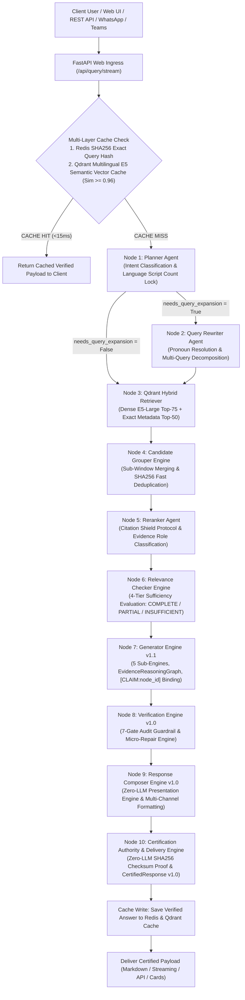

# Nomos AI End-to-End Query Request Flow

## 1. Request Lifecycle Overview

This document provides a step-by-step trace of how a query moves through the Nomos AI platform—from user submission in the web UI or API client, through authentication, multi-layer caching, 11-node agentic reasoning, verification, presentation composition, certification, and real-time Server-Sent Events (SSE) streaming back to the client.



---

## 2. Step-by-Step Execution Sequence

### Step 1: HTTP API Ingress & Validation
- **Endpoint**: `POST /api/query/stream` or `POST /api/query/v2`
- **Payload**:
  ```json
  {
    "question": "Under Article 78 of Decision 471 of 1995, what conditions apply to private school inmates?",
    "tenant_id": "default_tenant",
    "thread_id": "8dcde63c-1745-4464-b0ec-c3547d61de12",
    "chat_history": []
  }
  ```
- **Operations**:
  1. FastAPI validates input types via Pydantic models.
  2. Evaluates Rate Limiter (`FastAPILimiter` via Redis).
  3. Extracts auth token / tenant headers.

---

### Step 2: Multi-Layer Cache Check
1. **Exact Cache Check**:
   - Computes SHA256 hash of normalized query string.
   - Looks up Redis key `exact_cache:default_tenant:8dcde63c-...:v0:<hash>`.
   - **If Hit**: Immediately streams cached response payload. Execution terminates in $< 15\text{ ms}$.
2. **Semantic Cache Check (if Exact Cache misses)**:
   - Embeds query using `intfloat/multilingual-e5-large` (1024d dense vector).
   - Queries Qdrant collection `semantic_cache` with similarity threshold $\ge 0.96$.
   - **If Hit**: Returns cached answer text and citations. Execution terminates in $< 40\text{ ms}$.

---

### Step 3: LangGraph Workflow Execution Trace (`Node 1` to `Node 10`)

#### Node 1: Planner Agent (`agents/planner.py`)
- **Inputs**: `question`, `chat_history`.
- **Operations**: Evaluates Unicode script count ratio (`arabic_char_count / total_chars`) for language lock, classifies query intent (`FACT_LOOKUP`, `COMPARISON`, `PROCEDURAL`), extracts explicit statutory dates/numbers, and decides `needs_query_expansion`.
- **Outputs**: `planner_decision` dictionary.

#### Node 2: Query Rewriter Agent (`agents/query_rewriter.py`)
- **Condition**: Executed if `planner_decision["needs_query_expansion"] == True`.
- **Operations**: Resolves pronouns (`it`, `this`, `these`), prevents hallucinations, decomposes complex multi-topic questions into independent sub-queries, and verifies reference resolution via internal `_semantic_judge()`.
- **Outputs**: `current_query` and `retrieval_queries` list.

#### Node 3: Qdrant Hybrid Retriever (`retriever/builder.py`)
- **Operations**: Executes concurrent dual-provider retrieval:
  - **Dense Search**: Top-75 candidates using `intfloat/multilingual-e5-large` 1024d embeddings (`Distance.COSINE`).
  - **Exact Metadata Search**: Top-50 candidates querying Qdrant payload indices (`law_number`, `law_year`, `article_number`, `article_key`).
  - **Smart Statutory Neighbor Expansion**: Merges adjacent statutory neighbor articles.
- **Outputs**: 75 raw `Document` candidate chunks.

#### Node 4: Candidate Grouper Engine (`retriever/grouping.py`)
- **Operations**: Consolidates 75 raw candidate hits down to Top 15–20.
  - **Pass 1**: Sub-Window Merging (`_group_by_article_key`) staples sub-windows sharing `article_key` (e.g. `471_1995_78` Parts 1, 2, 3) back into a single unified article block.
  - **Pass 2**: Fast Hash Deduplication (`SHA256`) eliminates duplicate text passages.
  - **Pass 3**: Max Score Inheritance (`score_aggregation = "max"`) assigns maximum relevance score (`0.94`) to combined article block.
- **Outputs**: Top 15–20 consolidated candidate groups.

#### Node 5: Reranker Agent (`agents/reranker.py`)
- **Operations**: Calibrates raw scores, assigns `CandidateEvidenceRole` stickers (`PRIMARY_OBLIGATION`, `SANCTION_PENALTY`, `EXCEPTION_CLAUSE`), enforces Citation Shield Protocol, and filters candidate hits with threshold $\ge 0.0$.
- **Outputs**: Ordered reranked evidence bundle.

#### Node 6: Relevance Checker Engine (`agents/relevance_checker.py`)
- **Operations**: Quality gatekeeper executing a 4-Tier Decision Hierarchy:
  - **Tier 1**: Citation Match Check (Fast Exit rule, 0 tokens spent).
  - **Tier 2**: Coverage Score Check (`weighted_coverage_score >= 0.70`).
  - **Tier 3**: Role Completeness Check (`PRIMARY_OBLIGATION` presence).
  - **Tier 4**: LLM Sufficiency Audit (Fallback for multi-law comparison queries).
- **Outputs**: `relevance_result` (`sufficiency_level: COMPLETE | PARTIAL | INSUFFICIENT`, `generation_strategy`).

#### Node 7: Generator Engine v1.1 (`agents/generator.py`)
- **Operations**: Executes 5 sub-engines (`EvidenceReasoningGraphBuilder`, `ContextBudgetCompressor`, `PromptBuilderEngine`, `DraftGeneratorEngine`, `ClaimBindingEngine`). Generates factual draft text containing explicit `[CLAIM:node_id]` claim tags (`temperature = 0.0`).
- **Outputs**: `GeneratorOutput` and `EvidenceReasoningGraph`.

#### Node 8: Verification Engine v1.0 (`agents/verifier.py`)
- **Operations**: 7-Gate Audit Guardrail (`ClaimGrounding`, `CitationValidation`, `Contradiction`, `OutOfScope`, `GapDisclaimer`, `SchemaCompliance`, `MicroRepair`). Executes Micro-Repair actions (`INSERT_DISCLAIMER`, `REMOVE_CLAIM`, `REPLACE_CITATION`).
- **Outputs**: `VerificationResult` (`verification_status: PASS | PASS_WITH_WARNINGS | REPAIRED | FAIL`).

#### Node 9: Response Composer Engine v1.0 (`agents/composer.py`)
- **Operations**: Zero-LLM (0 API calls) deterministic presentation engine executing 7 sub-engines (`ContractValidator`, `ResponseSelector`, `AnswerBuilder`, `CitationComposer`, `WarningComposer`, `MetadataComposer`, `OutputFormatter`). Injects RTL unicode protection (`\u200f`), formats footnotes, and renders for target `OutputChannel`.
- **Outputs**: `ResponseOutput v1.0` payload.

#### Node 10: Certification Authority & Delivery Engine (`agents/certification_delivery.py`)
- **Operations**: Zero-LLM (0 API calls) final cryptographic auditing node. Executes 6 certification sub-engines, validates version matrix (`("1.1", "1.0", "1.0", "1.0")`), computes deterministic SHA256 checksum over canonical JSON (`_canonical_json`), and issues tamper-evident `CertifiedResponse v1.0`.
- **Outputs**: `CertifiedResponse v1.0` and `CertificationRecord`.

---

## 3. Cache Write & Client Delivery Phase

1. **Async Cache Write**:
   - Asynchronously writes verified response payload to Redis Exact Cache (24h TTL).
   - Asynchronously indexes query vector and verified answer payload into Qdrant Semantic Cache collection.
2. **Client Streaming / Formatting Delivery**:
   - `MARKDOWN`: Rendered for Next.js Web UI with Arabic RTL wrapper styling and collapsable citation blocks.
   - `STREAMING`: SSE JSON chunks delivered live to web client letter-by-letter.
   - `API`: Raw JSON payload delivered to REST API consumers.
   - `TEAMS` / `SLACK`: Adaptive Cards / Block Kit JSON rendered for corporate chat apps.
