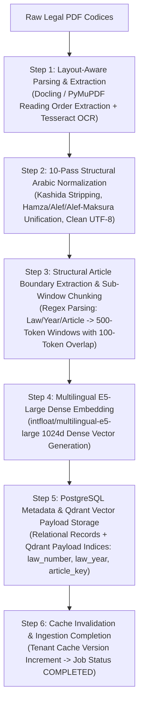

# Nomos AI End-to-End Document Ingestion Flow (Node 0)

## 1. Ingestion Subsystem Overview

The **Document Ingestion Engine** (`Node 0`: `document_processor/processor.py`) ingests raw legal codices (PDF documents, scanned decrees, executive regulations) and converts them into structured statutory chunks indexed in **Qdrant** (`ragnr_documents`) and **PostgreSQL**.



---

## 2. Detailed Ingestion Pipeline Stages

### Stage 1: Document Upload & Storage Ingress
- **Endpoint**: `POST /api/v1/ingest`
- **Inputs**: `file: UploadFile`, `tenant_id: str`, `thread_id: Optional[str]`
- **Actions**:
  1. Writes raw file to local storage or S3 bucket (`s3_client.upload_fileobj`).
  2. Inserts job record in PostgreSQL `document_jobs` table with `status = "PENDING"`.
  3. Dispatches async ingestion worker task (`process_document_task`).

---

### Stage 2: Layout-Aware Parsing & 10-Pass Normalization
- **Module**: `document_processor/pdf_parser.py` & `file_handler.py`
- **Parsing**: Utilizes **Docling** or **PyMuPDF** to extract text while maintaining spatial reading order. Applies OCR engine (Tesseract/EasyOCR) if page image density indicates scanned PDF.
- **10-Pass Arabic Text Normalization Pipeline**:
  1. Strip Kashida Tatweel diacritics (`ـ`).
  2. Normalize Alef forms (`أ`, `إ`, `آ` $\rightarrow$ `ا`).
  3. Normalize Alef Maksura (`ى` $\rightarrow$ `ي`).
  4. Normalize Teh Marbuta (`ة` $\rightarrow$ `ه`).
  5. Strip Arabic Harakat diacritics (Fatha, Damma, Kasra, Sukun, Shadda, Tanwin).
  6. Standardize Arabic/Eastern numerals to ASCII digits (`٠-٩` $\rightarrow$ `0-9`).
  7. Strip control characters (`\x00-\x1f`) and zero-width invisible unicode (`\u200b-\u200d`).
  8. Collapse redundant whitespace and tab characters.
  9. Normalize statutory punctuation brackets `(` and `)`.
  10. Enforce UTF-8 encoding integrity.

---

### Stage 3: Structural Article Boundary Extraction & Sub-Window Chunking
- **Module**: `document_processor/chunker.py`
- **Core Algorithm**: **Regex Structural Article Boundary Splitting** combined with sliding-window chunking (500 tokens with 100-token overlap).
- **Matching Rules**:
  ```python
  ARTICLE_REGEX = r'(?:المادة|المادّة|الماده|Article)\s*\(?\s*(\d+|\b[أ-ي]+\b)\s*\)?'
  LAW_REGEX = r'(?:قانون|قرار|مرسوم)\s+(?:اتحادي|وزاري)?\s*رقم\s*\(?\s*(\d+)\s*\)?\s*لسنة\s*(\d{4})'
  ```
- **Hierarchical Chunk Metadata**:
  - `article`: Article number (e.g. `"78"`)
  - `law_number`: Law number (e.g. `"471"`)
  - `law_year`: Law year (e.g. `"1995"`)
  - `article_key`: Unique canonical key (e.g. `"471_1995_78"`)
  - `sub_window_index`: Token sub-window index ($0, 1, 2$)
  - `parent_chunk_id`: ID of full parent article chunk (for Node 4 Sub-Window Merging).

---

### Stage 4: Dense Vector Embedding Computation
- **Model**: `intfloat/multilingual-e5-large`
- **Dense Vector**: 1024-dimensional floating point array representing deep semantic intent (`passage: <clean_text>`).

---

### Stage 5: Dual Storage Upsert

#### A. PostgreSQL Relational Persistence (`db/models.py`)
Creates or updates records across:
- `uploaded_documents`: Records file name, byte size, S3 URL, upload timestamp.
- `documents`: Stores statutory chunk text, article key, law number, and parent links.
- `document_families`: Groups related executive regulations under primary law codices.

#### B. Qdrant Vector Collection Payload Indexing (`db/qdrant_client.py`)
Upserts points to collection `ragnr_documents`:
```python
PointStruct(
    id=str(uuid.uuid4()),
    vector={
        "dense": dense_vector_1024d
    },
    payload={
        "text": clean_statutory_text,
        "tenant_id": tenant_id,          # e.g. "default_tenant"
        "thread_id": thread_id,          # e.g. "8dcde63c-..." or None for global
        "source": pdf_filename,
        "article": article_num,
        "law_number": law_num,
        "law_year": law_year,
        "article_key": article_key,
        "sub_window_index": window_idx,
        "parent_chunk_id": parent_id
    }
)
```

---

### Stage 6: Cache Invalidation & Telemetry Update
1. Increments Redis tenant version counter (`tenant_version:{tenant_id}`).
2. Invalidates exact query cache entries associated with the updated tenant scope.
3. Updates `document_jobs` status in PostgreSQL to `"COMPLETED"`.
