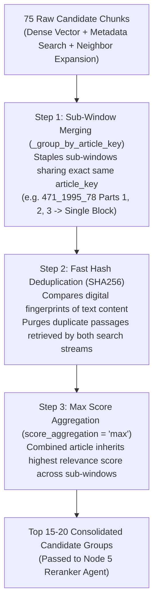

# 🧩 Subsystem Architecture: Candidate Grouper Engine (Node 4)

---

## 📌 Executive Summary & Scope

The **Candidate Grouper Engine** (`retriever/grouping.py`) consolidates raw candidate chunks from multi-provider search (Top 75) down to a unified, non-redundant evidence list (Top 15–20) before passing them to the Reranker Agent.

It resolves sliding-window fragmentation, merges child windows back into unified article blocks, and purges semantic duplicate text blocks.

---

## 🔄 Pipeline Node Sequence & Trajectory

```mermaid
flowchart LR
    Node0["Node 0:\nDocument Ingestion"] --> Node1["Node 1:\nPlanner Agent"]
    Node1 --> Node2["Node 2:\nQuery Rewriter"]
    Node2 --> Node3["Node 3:\nQdrant Hybrid Retriever"]
    Node3 --> Node4["★ Node 4:\nCandidate Grouper"]
    Node4 --> Node5["Node 5:\nReranker Agent"]
    Node5 --> Node6["Node 6:\nRelevance Checker"]
    Node6 --> Node7["Node 7:\nGenerator Engine"]
    Node7 --> Node8["Node 8:\nVerification Engine"]
    Node8 --> Node9["Node 9:\nResponse Composer"]
    Node9 --> Node10["Node 10:\nCertification Authority"]
```

- **Predecessor (Upstream)**: **Node 3** ([`Retrieval.md`](file:///d:/RagnrAI/project_documentation/architecture/Retrieval.md)) — Fetches 75 dense vector matches + 50 metadata matches.
- **Current Position**: **Node 4** (Candidate Grouper Engine) — Stapling child windows and purging duplicate text.
- **Successor (Downstream)**: **Node 5** ([`Reranker.md`](file:///d:/RagnrAI/project_documentation/architecture/Reranker.md)) — Assigning Evidence Roles & Citation Shield.

---

## 📖 The Intuitive Story: The Document Binder

Imagine receiving 75 loose, torn pieces of paper from a photocopier:
- Page 1 has Window 1 of Article 78.
- Page 2 has Window 2 of Article 78.
- Page 3 has Window 3 of Article 78.

If you hand all 3 pages separately to the judge, they have to re-assemble the puzzle in their mind!

The **Candidate Grouper** acts as the **Document Binder**:
1. It gathers all pages sharing the exact same Passport ID (`article_key = "471_1995_78"`).
2. It staples them back together in order ($0 \rightarrow 1 \rightarrow 2$).
3. It hands the judge **one clean, unified folder for Article 78**, eliminating duplicate headers and fragmented sentences.

---

## ⚙️ 1. Candidate Consolidation Pipeline (`retriever/grouping.py`)

---

## 🔍 2. In-Depth Explanation of Grouping Pass Mechanisms

### 2.1 Pass 1: Sub-Window Merging (`_group_by_article_key`)

- **Problem**: During PDF ingestion, long legal articles (e.g. Article 78) exceed the 500-token chunk window limit and are split into **Window 0** (tokens 0–500), **Window 1** (tokens 400–900), and **Window 2** (tokens 800–1200). During retrieval, Qdrant returns Window 0, Window 1, and Window 2 as 3 separate candidate items!
- **Solution**: Sub-Window Merging inspects the Passport ID (`article_key = "471_1995_78"`), identifies that all 3 sub-windows belong to the same statutory article, and **stitches them back together in chronological token order ($0 \rightarrow 1 \rightarrow 2$) into a single unified text block**.

#### Real-World Example:
- **Without Sub-Window Merging**:
  - Candidate Slot #1 in LLM Prompt: `Article 78 (Part 1)`
  - Candidate Slot #2 in LLM Prompt: `Article 78 (Part 2)`
  - Candidate Slot #3 in LLM Prompt: `Article 78 (Part 3)`
  *(Occupies 3 separate candidate slots in the prompt, crowding out other essential laws!)*
- **With Sub-Window Merging**:
  - Candidate Slot #1 in LLM Prompt: **`Article 78 (Complete Unified Text: Parts 1 + 2 + 3)`**
  *(Occupies only 1 candidate slot, preserving prompt context budget for Articles 79, 80, and 81!)*

---

### 2.2 Pass 2: Fast Hash Deduplication (`SHA256 Content Hashing`)

- **Problem**: Nomos AI executes **Dual-Provider Retrieval** (Dense Vector Search + Exact Metadata Search). Often, BOTH search streams discover the **EXACT SAME paragraph**!
- **Solution**: Fast Hash Deduplication generates a 64-character digital fingerprint (`SHA256`) of the clean text string (`hashlib.sha256(clean_text.encode('utf-8')).hexdigest()`). If two candidate chunks produce the exact same SHA256 hash, the grouper keeps the first chunk and **deletes the second chunk immediately**.

#### Real-World Example:
- Dense Vector Search finds: *"Disciplinary penalties must be logged in the special register."* $\rightarrow$ SHA256 Hash = `e3b0c44298fc1c149afbf4c8996fb92427ae41e4649b934ca495991b7852b855`
- Metadata Search finds: *"Disciplinary penalties must be logged in the special register."* $\rightarrow$ SHA256 Hash = `e3b0c44298fc1c149afbf4c8996fb92427ae41e4649b934ca495991b7852b855`
- **Deduplication Action**: SHA256 hashes match 100%! Keeps 1 copy and purges the redundant candidate.

---

### 2.3 Pass 3: Score Aggregation (`Max Score Inheritance`)

- **Problem**: When Sub-Window 0 (`score = 0.72`), Sub-Window 1 (`score = 0.94`), and Sub-Window 2 (`score = 0.51`) are merged into a single consolidated article block, **which score should the final combined article inherit**?
- **Solution**: The grouper applies **Max Score Inheritance** (`score_aggregation = "max"`). The combined article inherits the **maximum score (`0.94`)** achieved by any of its individual sub-windows.

#### Real-World Example:
- Sub-Window 1 (General intro text): Vector Score = `0.72`
- Sub-Window 2 (Contains exact penalty clause): Vector Score = `0.94`
- Sub-Window 3 (Closing procedure): Vector Score = `0.51`
- **Score Inheritance**: The consolidated `Article 78` block is assigned **`final_score = 0.94`**.
- **Impact**: Guarantees that Article 78 retains its top rank at position #1 because its most relevant sub-window scored `0.94`!

---

## 🎯 3. Summary Matrix of Grouping Passes & Performance Impact

| Consolidation Pass | Algorithmic Method | Plain-English Action | Quality & Performance Gain |
| :--- | :--- | :--- | :--- |
| **Sub-Window Merging** | Groups by `article_key` | Staples fragmented sub-windows (`Parts 1 + 2 + 3`) back into 1 complete article. | Stops 1 long article from eating up 5 separate candidate slots in the LLM prompt. |
| **Fast Hash Deduplication** | SHA256 content hashing | Compares digital fingerprints and deletes identical duplicate copies. | Eliminates redundant text retrieved by both dense and metadata search. |
| **Score Aggregation** | Max score inheritance (`score_aggregation = "max"`) | Assigns the highest score (`0.94`) of sub-windows to the combined article block. | Ensures consolidated article inherits maximum relevance ranking score. |
