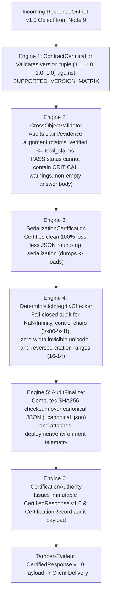

# 🔐 Subsystem Architecture: Certification Authority & Integrity Engine (Node 10)

---

## 📌 Executive Summary & Scope

The **Certification Authority & Delivery Engine** (`agents/certification_delivery.py`) is the final cryptographic auditing node of Nomos AI.

**CRITICAL INVARIANT**: **The Certification Engine uses NO LLM (Zero External API Calls)**. It calculates an immutable **SHA256 Cryptographic Checksum** of the canonical JSON output, verifies version matrix compatibility, and issues a tamper-evident **`CertifiedResponse v1.0`** record.

---

## 🔄 Pipeline Node Sequence & Trajectory

```mermaid
flowchart LR
    Node0["Node 0:\nDocument Ingestion"] --> Node1["Node 1:\nPlanner Agent"]
    Node1 --> Node2["Node 2:\nQuery Rewriter"]
    Node2 --> Node3["Node 3:\nQdrant Hybrid Retriever"]
    Node3 --> Node4["Node 4:\nCandidate Grouper"]
    Node4 --> Node5["Node 5:\nReranker Agent"]
    Node5 --> Node6["Node 6:\nRelevance Checker"]
    Node6 --> Node7["Node 7:\nGenerator Engine"]
    Node7 --> Node8["Node 8:\nVerification Engine"]
    Node8 --> Node9["Node 9:\nResponse Composer"]
    Node9 --> Node10["★ Node 10:\nCertification Authority"]
```



- **Predecessor (Upstream)**: **Node 9** ([`Response_Composer.md`](file:///d:/RagnrAI/project_documentation/architecture/Response_Composer.md)) — Zero-LLM deterministic presentation engine & multi-channel formatting.
- **Current Position**: **Node 10** (Certification Authority Engine) — Final cryptographic SHA256 checksum & tamper-evident certification issuance.
- **Successor (Downstream)**: Client Delivery / End User Display.

---

## 📖 The Intuitive Story: The Royal Notary Public

Imagine the Royal Notary Public issuing an official decree to a citizen:
- The Notary receives the final approved document from the Chief Publisher.
- The Notary does **NOT** edit a single word of the text.
- Instead, the Notary:
  1. Computes a digital fingerprint (SHA256 hash) of the document.
  2. Applies an official wax seal and certificate registration number (`record_id`).
  3. Archives the certificate in the government vault for audit inspection.
  4. Delivers the sealed document to the citizen.

That Royal Notary is the **Certification Authority Engine**.

---

## ⚙️ 1. The 6 Certification Sub-Engines (`agents/certification_delivery.py`)



---

## 🔍 2. Deep-Dive Specification of the 6 Certification Sub-Engines

### 2.1 Engine 1: `ContractCertification` (`agents/certification_delivery.py:L140-L160`)
- **Role**: Validates component version matrix compatibility.
- **Mechanism**: Inspects the 4-tuple version signature `(generator, verifier, composer, certification)` against `SUPPORTED_VERSION_MATRIX`.
- **Supported Tuple**: `("1.1", "1.0", "1.0", "1.0") == True`. Any unverified plugin or version mismatch fails closed with `INCOMPATIBLE_VERSION_MATRIX`.

---

### 2.2 Engine 2: `CrossObjectValidator` (`agents/certification_delivery.py:L167-L225`)
- **Role**: Audits internal cross-object metadata alignment and flags data drift.
- **Fail-Closed Audit Rules**:
  - `claims_verified` cannot exceed `total_claims`.
  - `output.confidence` must match `metadata.confidence` within `1e-4`.
  - `verification_status == "PASS"` cannot co-exist with `ResponseStatus == "REFUSAL"`.
  - `verification_status == "PASS"` cannot contain any `CRITICAL` or `BLOCKING` warnings.
  - `ResponseStatus == "ANSWER"` or `"PARTIAL_ANSWER"` must have a non-empty text body.

---

### 2.3 Engine 3: `SerializationCertification` (`agents/certification_delivery.py:L231-L260`)
- **Role**: Certifies that the response payload can perform a 100% loss-less round-trip JSON serialization.
- **Mechanism**: Executes `json.loads(json.dumps(output.model_dump(), ensure_ascii=False))`. Fails closed if any serialization exception or field mutation occurs.

---

### 2.4 Engine 4: `DeterministicIntegrityChecker` (`agents/certification_delivery.py:L265-L320`)
- **Role**: Fail-closed inspection for numerical anomalies and malicious character injections:
  - **Numerical Inspection**: Rejects `NaN` (Not a Number) or `Infinity` in confidence scores.
  - **Control Character Inspection**: Detects ASCII control characters (`\x00-\x08`, `\x0b-\x0c`, `\x0e-\x1f`, `\x7f`).
  - **Zero-Width Character Inspection**: Flags invisible zero-width unicode pollution (`\u200b-\u200d`, `\ufeff`).
  - **Reversed Citation Range Check**: Flags broken citation article ranges (e.g. `Articles 16–14` where start `16` > end `14`).

---

### 2.5 Engine 5: `AuditFinalizer` (`agents/certification_delivery.py:L351-L399`)
- **Role**: Computes the immutable SHA256 cryptographic checksum over the canonical JSON representation of the output.
- **Canonical JSON Formatting (`_canonical_json`)**:
  - Sorts all keys alphabetically (`sort_keys=True`).
  - Eliminates whitespace separators (`separators=(',', ':')`).
  - Preserves UTF-8 Arabic characters (`ensure_ascii=False`).
  - Guarantees byte-level determinism: same response object $\rightarrow$ exact same SHA256 checksum byte string.
- **Telemetry Assembly**: Captures deployment telemetry (`deployment_id`, `environment`, `git_commit`, `hostname`, `timestamp`).

---

### 2.6 Engine 6: `CertificationAuthority` (`agents/certification_delivery.py:L405-L430`)
- **Role**: Issues the tamper-evident **`CertifiedResponse v1.0`** public payload and archives the immutable **`CertificationRecord`** audit record in government logs.

---

## 🔒 3. SHA256 Cryptographic Checksum & Fail-Closed Tamper Proofing

The engine calculates an immutable SHA256 checksum over the canonical JSON representation of the final output:

$$\text{Checksum} = \text{SHA256}(\text{canonical\_json}(\text{ResponseOutput}))$$

```python
def _canonical_json(output: ResponseOutput) -> str:
    dumped = output.model_dump()
    return json.dumps(dumped, sort_keys=True, ensure_ascii=False, separators=(',', ':'))

checksum = hashlib.sha256(canonical_str.encode('utf-8')).hexdigest()
```

If a malicious actor or network proxy alters a single character of the response in transit (e.g. modifying *"5,000 AED"* to *"50,000 AED"*), recalculating the SHA256 checksum will instantly fail the verification audit, flagging the payload as tampered.

---

## 📦 4. Delivery Adapters Specifications (`agents/certification_delivery.py:L430-L540`)

After certification, specialized delivery adapters format the certified payload for target client channels:

| Delivery Adapter | Target Channel | Output Format & Responsibilities | Code Location |
| :--- | :--- | :--- | :--- |
| **`APIDeliveryAdapter`** | REST API Clients | Wraps output in raw `CertifiedResponse v1.0` JSON payload with `record_id` and `checksum`. | `certification_delivery.py:L440` |
| **`MarkdownDeliveryAdapter`** | Next.js Web UI | Renders GFM Markdown with Arabic RTL styling and appends an official cryptographic seal footer. | `certification_delivery.py:L465` |
| **`StreamingDeliveryAdapter`** | Server-Sent Events (SSE) | Emits real-time SSE token delta events (`data: {...}`) followed by a `certification_complete` event. | `certification_delivery.py:L495` |
| **`PDFDeliveryAdapter`** | PDF Print Exports | Renders PDF document export with an official government cryptographic wax seal header. | `certification_delivery.py:L520` |
| **`DOCXDeliveryAdapter`** | MS Word Exports | Generates Microsoft Word document with embedded audit watermark metadata. | `certification_delivery.py:L535` |

---

## 📦 5. Public Data Contracts: `CertifiedResponse v1.0` & `CertificationRecord`

```json
{
  "contract_version": "1.0",
  "record_id": "AUDIT_a8f3b9c2",
  "checksum": "e3b0c44298fc1c149afbf4c8996fb92427ae41e4649b934ca495991b7852b855",
  "certification_status": "CERTIFIED",
  "response": {
    "schema_version": "1.0",
    "response_status": "ANSWER",
    "answer_text": "بناءً على أحكام المادة (78) من القانون الاتحادي...",
    "citations": [
      {
        "citation_key": "471_1995_78",
        "law_title": "قانون المنشآت العقابية",
        "law_number": "471",
        "law_year": "1995",
        "articles": ["78"],
        "formatted": "المادة (78) من القانون الاتحادي رقم 471 لسنة 1995"
      }
    ],
    "warnings": [],
    "metadata": {
      "confidence": 0.94,
      "verification_score": 1.0,
      "total_latency_ms": 420.5,
      "verification_status": "PASS"
    }
  },
  "audit_telemetry": {
    "deployment_id": "SAG-UAE-GOV-01",
    "environment": "PRODUCTION",
    "git_commit": "a1b2c3d4",
    "timestamp": "2026-08-11T13:50:00Z"
  }
}
```
