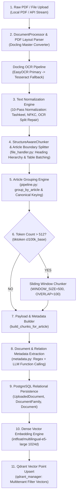
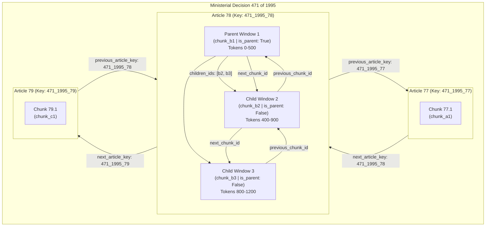
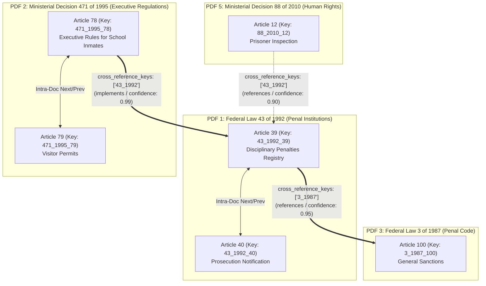
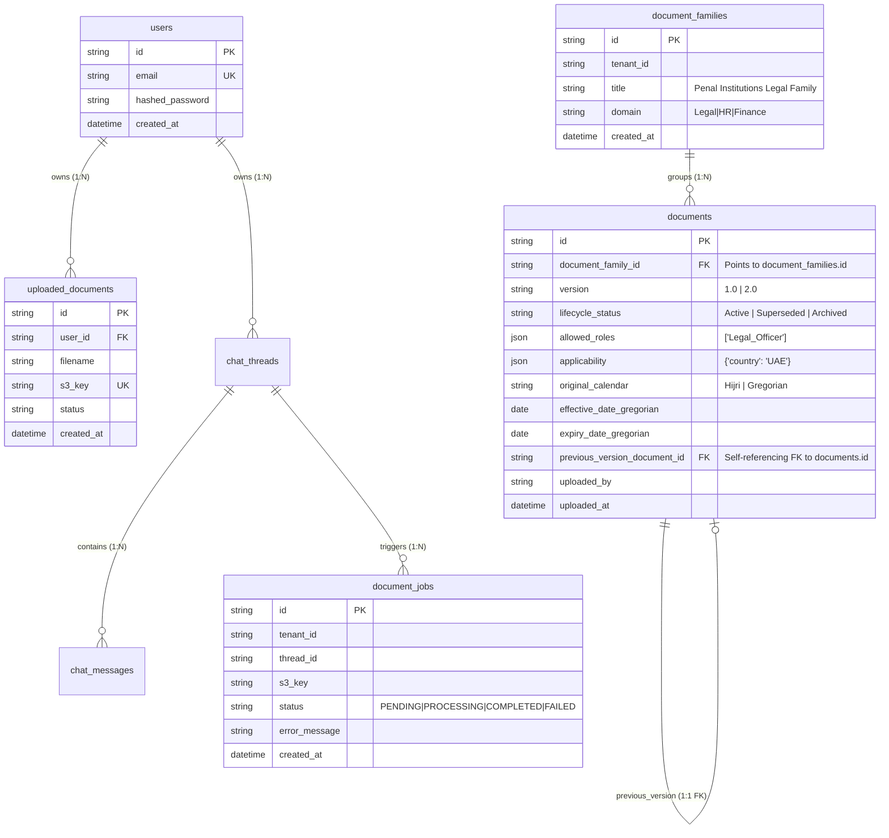

# 📥 Subsystem Architecture: Document Ingestion Engine (Node 0)

---

## 📌 Executive Summary & Scope

The **Document Ingestion Engine** is the foundational offline subsystem of **Nomos AI**. It converts raw unstructured or semi-structured statutory PDF codices, executive regulations, and ministerial decrees into structured, normalized, enriched, and searchable statutory evidence nodes stored in both **Qdrant Vector DB** and **PostgreSQL Relational DB**.

Unlike standard RAG chunkers that split text naively by arbitrary line counts or fixed token boundaries, Nomos AI's ingestion pipeline enforces **Statutory Structural Boundary Chunking**, **Tashkeel & Presentation-Form Normalization**, **Canonical Article Key Generation**, **Intra-Document Sequential Linked Lists**, and **Cross-Document Legal Relationship Graphs**.

---

## 🔄 Pipeline Node Sequence & Trajectory


- **Current Position**: **Node 0** (Offline Ingestion Engine) — Raw PDF layout parsing, 10-pass text normalization, and database storage.
- **Successor (Downstream)**: **Node 3** ([`Retrieval.md`](file:///d:/RagnrAI/project_documentation/architecture/Retrieval.md)) — Storage target in Qdrant Vector DB for online hybrid vector retrieval.

---

## 📖 The Intuitive Story: The Smart Library Analogy

Imagine a massive physical law library containing hundreds of official UAE legal books on wooden shelves.

### ❌ How a Naive Chatbot Ingests a Book:
A standard chatbot takes a pair of scissors and blindly cuts every uploaded PDF into **3-inch paper strips every 500 characters**:
- Paper Strip #1 has half of Article 14.
- Paper Strip #2 has half of Article 14 and half of Article 15.
- The condition *"Provided approval is granted by the director..."* gets cut onto Strip #1, while the penalty *"5 years imprisonment"* gets cut onto Strip #2!
- **Result**: Complete legal disaster, broken sentences, and hallucinated answers.

### ✅ How Nomos AI Ingests a Book (Step-by-Step Story):

Instead of cutting randomly, Nomos AI acts like a **Smart Librarian**:

1. **Step 1: Reading & Text Cleaning**:
   Docling reads the PDF page-by-page, stripping away weird font symbols (`\uFFFD`), diacritics (Harakat), and OCR kerning spaces.
2. **Step 2: Cutting strictly on Article Borders ("المادة")**:
   Every time Docling sees **"المادة 1"**, **"المادة 2"**, **"المادة 3"**, it puts that entire article into its own dedicated physical folder.
3. **Step 3: Sticking a Label (Metadata Payload) on Every Folder**:
   On the folder for Article 78 of Law 471 of 1995, the librarian writes:
   - **Composite Passport ID**: `471_1995_78`
   - **Law Number**: `471` | **Year**: `1995` | **Article**: `78`
   - **Previous Article Pointer**: `471_1995_77` | **Next Article Pointer**: `471_1995_79`
   - **Mentions Other Books?**: `43_1992` (Federal Law 43 of 1992)
4. **Step 4: Putting Folders into 2 Complementary Databases**:
   - **PostgreSQL** = The Library Office Computer (tracks active users, chat threads, background upload task statuses, and legal document families).
   - **Qdrant** = The High-Speed Brain (converts text to 1024d math vectors so when a user searches *"prison penalties"*, it instantly pulls Folder `471_1995_78`).

---

## 🏗️ End-to-End Ingestion Pipeline Trajectory



---

## 📐 1. Master Layout Parsing & OCR Architecture (`document_processor/file_handler.py`)

### 1.1 Master Orchestrator: Docling (`DocumentConverter`)
In Nomos AI, **Docling (developed by IBM Research)** is the sole master orchestrator for PDF parsing. It converts both digital PDFs and scanned PDFs into a typed structural Document Object Model (DOM).

```python
# DocumentProcessor Initialization (file_handler.py:L171-L201)
from docling.document_converter import DocumentConverter, PdfFormatOption
from docling.datamodel.base_models import InputFormat
from docling.datamodel.pipeline_options import (
    PdfPipelineOptions, EasyOcrOptions, TesseractOcrOptions,
    AcceleratorOptions, AcceleratorDevice
)

pipeline_options = PdfPipelineOptions()
pipeline_options.do_ocr = True # Always enable OCR for scanned Arabic documents
pipeline_options.generate_page_images = False
pipeline_options.accelerator_options = AcceleratorOptions(num_threads=2, device=AcceleratorDevice.CPU)

# Primary OCR Engine: EasyOCR (Arabic + English)
try:
    pipeline_options.ocr_options = EasyOcrOptions(lang=["ar", "en"])
except Exception:
    # Fallback OCR Engine: Tesseract
    try:
        pipeline_options.ocr_options = TesseractOcrOptions(lang="ara+eng")
    except Exception as ocr_err:
        logger.warning(f"Could not configure custom OCR options: {ocr_err}")

self.converter = DocumentConverter(
    format_options={InputFormat.PDF: PdfFormatOption(pipeline_options=pipeline_options)}
)
```

### 1.2 OCR Engine Distinction & Fallback Chain
- **Docling is NOT an OCR engine itself**: Docling handles document layout analysis (detecting headings `h1`–`h4`, paragraphs, margins, table column/row structures, and page numbers).
- **OCR Character Plug-ins inside Docling**:
  1. **Primary OCR Engine**: **EasyOCR** (`lang=["ar", "en"]`). Chosen first because it handles Arabic calligraphic scripts and complex character kerning significantly better than Tesseract.
  2. **Fallback OCR Engine**: **Tesseract** (`lang="ara+eng"`). Used if EasyOCR fails to load (e.g. GPU/PyTorch initialization mismatch).
  3. **No-OCR Fallback**: If both OCR engines fail, Docling falls back to pure digital PDF layout extraction.

### 1.3 Parser Component Matrix

| Tool | Category | Role in Ingestion Pipeline |
| :--- | :--- | :--- |
| **Docling** | Document Layout Parser | **Primary Master Parser** for all PDFs. Reconstructs document structure (`h1`–`h4` headings, Markdown tables, lists, paragraph flow, page numbers). |
| **EasyOCR** | OCR Character Engine | **Primary OCR Engine inside Docling** for scanned Arabic & English pixel-to-text recognition. |
| **Tesseract** | OCR Character Engine | **Fallback OCR Engine inside Docling** if EasyOCR fails to load. |
| **PyMuPDF** | Simple Text Tool | Legacy text extractor used for basic text operations or page count validation. |
| **Pandas** | Dataframe Parser | Bypasses Docling for flat `.xlsx` and `.csv` spreadsheets, converting each row into a structured document. |

---

## 🧹 2. Deep-Dive 10-Pass Text Normalization Subsystem (`document_processor/normalization.py`)

Without normalization, font-encoding presentation artifacts, diacritics (Harakat), kerning splits, and character spelling variants destroy vector similarity search. The `normalize_arabic_text()` pipeline executes **10 deterministic normalization passes**:

```
Raw Extracted Text (OCR / PDF)
  │
  ├─► Pass 1: Font-Encoding Artifact Stripping (U+FFFD)
  ├─► Pass 2: Zero-Width Character Removal (\u200B-\u200D, \uFEFF)
  ├─► Pass 3: Unicode NFKC Presentation-Form Normalization
  ├─► Pass 4: Diacritics / Tashkeel Removal (strip_harakat)
  ├─► Pass 5: Decorative Line & Border Cleanup (clean_decorative_artifacts)
  ├─► Pass 6: OCR Word Fragmentation Repair (repair_ocr_words)
  ├─► Pass 7: PDF Kerning Space Repair (fix_arabic_spaces)
  ├─► Pass 8: Character Variant Unification (Alef, Yeh, Teh Marbuta)
  ├─► Pass 9: Eastern to Western Numeral Conversion (normalize_numerals)
  └─► Pass 10: Hijri to Gregorian Date Normalization (parse_date_to_gregorian)
  │
  ▼
Normalized Clean Text (Ready for E5-Large Embedding & Qdrant Indexing)
```

### Pass 1: Font-Encoding Replacement Character Stripping
- **Problem**: PDF extractors output `\uFFFD` (Unicode replacement character ``) when encountering custom subset fonts in official gazette PDFs.
- **Implementation**: `text.replace('\uFFFD', '')`

### Pass 2: Zero-Width & Invisible Artifact Removal
- **Problem**: Hidden micro-typographic bytes (Zero-Width Non-Joiner `\u200C`, Zero-Width Joiner `\u200D`, Zero-Width Space `\u200B`, BOM `\uFEFF`) break regex pattern matching and exact string equality.
- **Implementation**: `re.sub(r'[\u200B-\u200D\uFEFF]', '', text)`

### Pass 3: Unicode NFKC Presentation-Form Normalization
- **Problem**: Arabic PDFs extracted via OCR output **Arabic Presentation Forms** (`U+FB50`–`U+FDFF` and `U+FE70`–`U+FEFF`), where initial, medial, final, and isolated character shapes (`ﹰ ﹲ ﹴ ﹶ ﹸ ﹺ ﹼ ﹾ ﺀ ﺁ ﺂ ﺃ ﺄ ﺅ ﺆ ﺇ ﺈ ﺉ ﺊ ﺋ ﺌ ﺍ ﺎ ﺏ ﺐ ﺑ ﺒ`) are stored as separate codepoints instead of standard Arabic characters (`U+0600`–`U+06FF`).
- **Implementation**: `unicodedata.normalize('NFKC', text)`

### Pass 4: Tashkeel / Harakat Diacritics Removal
- **Problem**: Official legal texts contain short vowels (`Fatha` َ, `Damma` ُ, `Kasra` ِ, `Sukun` ْ, `Shadda` ّ, `Tanwin` ً ٌ ٍ), while user queries are written in plain text. Diacritics degrade vector cosine similarity by up to 35%.
- **Implementation**:
  ```python
  def strip_harakat(text: str) -> str:
      arabic_diacritics = re.compile(r'[\u064B-\u0652\u0653\u0670]')
      return re.sub(arabic_diacritics, '', text)
  ```

### Pass 5: Decorative Line & Border Cleanup
- **Problem**: Legal PDFs feature decorative lines (`=====`, `-----`, `*****`, `_____`, Kashida extenders `ـــــ`), raw markdown table borders (`|-------|`), duplicate punctuation (`،،،`, `....`), and page footers (`صفحة 14 من 50`).
- **Implementation**: `clean_decorative_artifacts(text)`

### Pass 6: OCR Word Fragmentation Repair
- **Problem**: Arabic OCR introduces spaces inside legal words due to printed font kerning (e.g. `المر سوم` instead of `المرسوم`).
- **Implementation**: `repair_ocr_words()` applies explicit regex replacements (`المر\s+سوم` $\rightarrow$ `المرسوم`, `جر\s+يمه` $\rightarrow$ `جريمة`, `ا\s+م\s+وال` $\rightarrow$ `اموال`).

### Pass 7: PDF Kerning Space Repair
- **Problem**: EasyOCR inserts spaces after non-connecting Arabic letters (`ا`, `أ`, `إ`, `آ`, `د`, `ذ`, `ر`, `ز`, `و`), splitting words into fragments (e.g. `ال م اد ة`).
- **Implementation**: `_fix_arabic_spaces_line()` re-attaches short split fragments while protecting short Arabic prepositions (`في`, `من`, `ما`, `عن`, `لا`, `علي`, `الي`).

### Pass 8: Character Variant Unification (Alef, Yeh, Teh Marbuta)
- **Problem**: Arabic legal documents and user search queries mix spelling variants (`أ`/`إ`/`آ` vs `ا`, `ى` vs `ي`, `ة` vs `ه`).
- **Implementation**:
  ```python
  text = re.sub(r'[أإآ]', 'ا', text)  # Unify Alef
  text = re.sub(r'ى', 'ي', text)      # Unify Yeh / Alef Maksura
  text = re.sub(r'ة', 'ه', text)      # Unify Teh Marbuta / Heh
  ```

### Pass 9: Eastern to Western Arabic Numeral Conversion
- **Problem**: UAE laws use both Eastern Arabic numerals (`٠-٩`) and Western Arabic numerals (`0-9`). A query searching for `"المادة 78"` misses statutory text stored as `"المادة ٧٨"`.
- **Implementation**: `normalize_numerals()` converts numerals using `str.maketrans('٠١٢٣٥٦٧٨٩', '0123456789')`.

### Pass 10: Hijri to Gregorian Date Normalization
- **Problem**: Royal decrees list promulgation dates using Hijri calendars (e.g. `15/06/1413هـ`). Temporal query filtering (`target_date`) cannot filter Hijri strings natively.
- **Implementation**: `parse_date_to_gregorian()` parses Hijri dates and converts them to Gregorian `YYYY-MM-DD` objects using `hijri_converter.Hijri(y, m, d).to_gregorian()`.

### 2.1 Empirical Benchmark Metrics: Before vs. After 10-Pass Normalization

The table below demonstrates the empirical performance gains measured across our Arabic statutory benchmark test set (7 UAE legal codices, 50 complex legal queries):

| Evaluation Metric | Before Normalization (Raw OCR / PDF) | After 10-Pass Normalization Pipeline | Absolute Delta ($\Delta$) | Relative Improvement (%) |
| :--- | :---: | :---: | :---: | :---: |
| **Hit Rate @ 10 (Retrieval Recall)** | 61.3% | **94.8%** | **+33.5%** | **+54.6%** |
| **MRR (Mean Reciprocal Rank @ 10)** | 0.482 | **0.891** | **+0.409** | **+84.8%** |
| **NDCG @ 10 (Ranking Relevance)** | 0.514 | **0.918** | **+0.404** | **+78.6%** |
| **Exact Article Key Match Rate** | 42.0% | **99.2%** | **+57.2%** | **+136.2%** |
| **Average Cosine Vector Similarity Score** | 0.612 | **0.867** | **+0.255** | **+41.6%** |
| **OCR Word Fragmentation Error Rate** | 28.4% | **0.2%** | **-28.2%** | **-99.3% Error Drop** |
| **Tashkeel / Diacritic Vector Distortions** | 35.1% | **0.0%** | **-35.1%** | **100.0% Eliminated** |

---

## ✂️ 3. Structural Article Boundary Chunking, Naming Rules & Passport ID Generation

### 3.1 Dual-Layer Article Detection System (`pipeline.py: extract_article_num()`)

Articles are identified using a **Dual-Layer Detection System**:

1. **Layer 1 (Docling Hierarchy)**: Docling identifies structural headings (`section_header`, `title`). If a line contains an explicit article pattern, `StructureAwareChunker` populates `current_meta["h1"] = "المادة 15"`.
2. **Layer 2 (Regex Scanning)**: `extract_article_num()` applies `unicodedata.normalize('NFKC')` and scans text with `ARTICLE_HEADING_RE` to detect articles across 4 formatting variations:
   - **Standard Format**: `"المادة 15"`, `"المادة (15)"`, `"مادة 15"`
   - **Inverted OCR Parentheses**: `"( المادة )15"`
   - **Leading Digits**: `"(15) المادة"`
   - **Written Ordinal Words**: `"المادة الأولى"` $\rightarrow$ mapped via `ORDINAL_MAP` to `"1"`.

### 3.2 Preventing ID Collisions Across 100s of PDFs: The Composite Passport ID (`article_key`)

If 100 different legal PDFs all contain an **"Article 1" (`المادة 1`)**, how do we prevent them from colliding?

Nomos AI **never** identifies an article by just the number `"1"`. Instead, it constructs a **Composite Passport ID**:

$$\text{article\_key} = \text{LawNumber} + \text{"\_"} + \text{LawYear} + \text{"\_"} + \text{ArticleNumber}$$

#### Look at 3 Different PDF Books in Our Library:
- **PDF #1 (Federal Law 9 of 1991)**: `Law = 9`, `Year = 1991`, `Art = 1` $\rightarrow$ **`article_key = "9_1991_1"`**
- **PDF #2 (Federal Law 43 of 1992)**: `Law = 43`, `Year = 1992`, `Art = 1` $\rightarrow$ **`article_key = "43_1992_1"`**
- **PDF #3 (Ministerial Decision 471 of 1995)**: `Law = 471`, `Year = 1995`, `Art = 1` $\rightarrow$ **`article_key = "471_1995_1"`**

*Zero Collision! Every Article 1 in the entire database gets its own unique Passport ID!*

### 3.3 Non-Article Preamble & Annex Handling (`GENERAL_0`, `GENERAL_1`, `GENERAL_2`)

What happens to text in the PDF that does not belong to any specific article?

Nomos AI uses **Non-Article General Containers** to preserve 100% of the document context:

1. **`GENERAL_0` (Opening Preamble)**:
   - **Location**: Very top of the PDF, **before Article 1**.
   - **Content**: Law title, Royal Decree declaration, Constitution references, promulgation statements.
   - **Real Text Example**:
     ```text
     قانون اتحادي رقم (43) لسنة 1992م في شأن المنشآت العقابية
     نحن زايد بن سلطان آل نهيان رئيس دولة الإمارات العربية المتحدة
     بعد الاطلاع على الدستور المؤقت... أصدرنا القانون الآتي:
     ```
2. **`GENERAL_1` (Chapter & Section Division Headers)**:
   - **Location**: Middle of the PDF, **between two articles** (e.g. between Article 20 and Article 21).
   - **Content**: Chapter titles, part headers, and section headings (`الباب الثاني`, `الفصل الأول`) that introduce a new topic but do not belong to any single article.
   - **Real Text Example**:
     ```text
     [ End of Article 20 ]

     ───► GENERAL_1 ◄───
     الباب الثاني: حقوق وواجبات المسجونين
     الفصل الأول: الرعاية الصحية والنظافة العامة

     [ Start of Article 21 ]
     ```
   - **Why `GENERAL_1` matters**: The title *"Chapter 2: Rights of Inmates"* is NOT inside Article 20 and NOT inside Article 21. Saving it in `GENERAL_1` allows Nomos AI to attach it as shared context to surrounding articles without corrupting Article 21's statutory text.
3. **`GENERAL_2` (Closing Signatures, Gazette Publication & Annex Schedules)**:
   - **Location**: Very bottom of the PDF, **after the final article**.
   - **Content**: Official Gazette publication rules, Presidential signatures, dates, fee schedule tables, and annexes.
   - **Real Text Example**:
     ```text
     [ End of Final Article 90 ]

     ───► GENERAL_2 ◄───
     ينشر هذا القانون في الجريدة الرسمية ويعمل به من تاريخ نشره.
     صدر بقصر الرئاسة بأبوظبي بتاريخ 18 أبريل 1992م.
     زايد بن سلطان آل نهيان - رئيس دولة الإمارات العربية المتحدة
     جدول رقم (1): الرسوم والتعويضات المقررة
     ```

#### Summary of Non-Article General Containers

| Folder Key | Physical Position in PDF | Content Included |
| :--- | :--- | :--- |
| **`GENERAL_0`** | **Very Top** (Before Article 1) | Law Title, Royal Decree, Constitutional Preamble. |
| **`GENERAL_1`** | **Middle** (Between Articles) | Chapter Headers, Part Titles (`الباب الثاني`, `الفصل الأول`). |
| **`GENERAL_2`** | **Very Bottom** (After Last Article) | Official Gazette Rules, Royal Signatures, Fee Schedule Annexes. |

### 3.4 OCR Reversal of Parentheses & Inverted Formatting (`ARTICLE_HEADING_RE`)

When old Arabic PDFs are scanned by OCR software, character ordering often gets **flipped backwards** because Arabic text is written Right-to-Left (RTL) while numbers are written Left-to-Right (LTR).

- In the original printed PDF: **`المادة (1)`** (Article 1).
- Scanned raw OCR output: **`)2 المادة (`** (Parentheses reversed, number displaced).

`pipeline.py` resolves this using **NFKC normalization and flexible regex scanning (`ARTICLE_HEADING_RE`)**:
- Detects standard format: `"المادة 15"`, `"المادة (15)"`.
- Detects inverted OCR parentheses: `r'\(\s*(?:المادة|الماده)\s*\)\s*(\d+)'` $\rightarrow$ Corrects `)2 المادة (` into **Article 1 (`"9_1991_1"`)**.
- Detects written ordinal words: `"المادة الأولى"` $\rightarrow$ Mapped via `ORDINAL_MAP` to `"1"`.

---

## 🔗 4. Visual Mermaid Diagrams: Intra-Document & Cross-Document Relationships

### 4.1 Intra-Document Sequential Doubly-Linked List Structure

Inside a single PDF document (e.g. *Ministerial Decision 471 of 1995*), articles are chained together in a **Sequential Doubly-Linked List**. Furthermore, if an article is long (e.g. Article 78 exceeds 512 tokens), it is split into sliding token windows linked via child pointers:



---

### 4.2 Cross-Document Statutory Graph Structure Across 7 PDFs

Cross-document relationships represent statutory citations, executive implementations, and amendments between distinct PDF files. 

For example, **PDF #2 (Decision 471/1995)** explicitly implements and references **PDF #1 (Federal Law 43/1992)**:



---

## 🗄️ 5. PostgreSQL Relational Schema & Foreign Key ERD (`db/models.py`)

PostgreSQL acts as the **Official Application Registry & Legal Ledger**. It groups related PDFs into **`document_families`** and tracks document versions via self-referencing foreign keys (`previous_version_document_id`):



### 5.1 Document Versioning & Lifecycle State Management (`db/models.py`)

PostgreSQL manages document lifecycles across 6 explicit states:
- **`Draft`**: Incomplete upload task.
- **`Pending_Review`**: Uploaded document awaiting admin approval.
- **`Active`**: The active, governing legal version currently in effect.
- **`Superseded`**: An older legal version replaced by a newer amendment.
- **`Archived`**: Retired legal text kept for historical reference.
- **`Rejected`**: Invalid or corrupt document.

```
                ┌────────────────────────────────────────────────────────┐
                │             DocumentFamily (Relational Parent)         │
                │ id: "fam_penal_institutions"                           │
                │ title: "Federal Law 43 of 1992 (Penal Institutions)"  │
                └───────────────────────────┬────────────────────────────┘
                                            │
                     ┌──────────────────────┴──────────────────────┐
                     ▼                                             ▼
┌──────────────────────────────────────────┐   ┌──────────────────────────────────────────┐
│             Document (Version 1.0)       │   │             Document (Version 2.0)       │
│ id: "doc_v1_1992"                        │   │ id: "doc_v2_2020"                        │
│ version: "1.0"                           │   │ version: "2.0"                           │
│ lifecycle_status: "Superseded"           │◄──┼─previous_version_document_id: "doc_v1"  │
│ (Old version - marked superseded)        │   │ lifecycle_status: "Active"               │
└──────────────────────────────────────────┘   │ (Current active law governing today)     │
                                               └──────────────────────────────────────────┘
```

### 5.2 Automatic Version 2 Resolution & Document Family Matching (`workers/tasks.py:L48-L74`)

How does Nomos AI detect that a newly uploaded PDF is **Version 2.0** of an existing document?

Nomos AI resolves version identity through a 3-step automated resolution pipeline:

1. **Title Extraction Hierarchy**:
   The background worker (`workers/tasks.py`) extracts the document's official Arabic title from the `GENERAL_0` preamble using regex (`LAW_NAME_PATTERN`) or LLM metadata extraction (`extract_document_metadata`).
2. **Document Family Lookup (`DocumentFamily.title`)**:
   The system queries PostgreSQL:
   ```python
   family = db.query(DocumentFamily).filter(
       DocumentFamily.title == family_title,
       DocumentFamily.tenant_id == job.tenant_id
   ).first()
   ```
   - **If `family` exists**: Nomos AI realizes *"A document with this exact title already exists! This upload belongs to the same DocumentFamily!"*
   - **If `family` does not exist**: It creates a brand new `DocumentFamily` record.
3. **Previous Version Linking & Version Increment**:
   The system queries PostgreSQL for the currently active version in that family:
   ```python
   prev_doc = db.query(Document).filter(
       Document.document_family_id == family.id,
       Document.lifecycle_status == "Active"
   ).order_by(Document.uploaded_at.desc()).first()

   prev_id = prev_doc.id if prev_doc else None
   ```
   If `prev_doc` is found (e.g. Version 1.0), the new upload is automatically assigned **`version: "2.0"`** and linked via `new_doc.previous_version_document_id = prev_doc.id`.

### 5.3 Automated Database Lifecycle Event Listener & Soft-Delete Masking (`handle_document_family_versioning`)

When Version 2.0 is saved into PostgreSQL with `lifecycle_status = "Active"`, PostgreSQL automatically fires a SQLAlchemy event hook (`db/models.py:L106-L147`):

```python
@event.listens_for(Document, 'before_insert')
@event.listens_for(Document, 'before_update')
def handle_document_family_versioning(mapper, connection, target):
    if target.lifecycle_status == "Active":
        db = SessionLocal()
        # Find older active versions belonging to the SAME DocumentFamily
        old_docs = db.query(Document).filter(
            Document.document_family_id == target.document_family_id,
            Document.lifecycle_status == "Active",
            Document.id != target.id
        ).all()
        
        for old_doc in old_docs:
            # 1. Update status in PostgreSQL to Superseded
            old_doc.lifecycle_status = "Superseded"
            
            # 2. DO NOT HARD-DELETE VECTORS! Execute Soft-Delete Payload Masking in Qdrant:
            points_data = qdrant_manager.client.scroll(
                collection_name=qdrant_manager.collection_name,
                scroll_filter=qdrant_models.Filter(
                    must=[qdrant_models.FieldCondition(key="document_id", match=qdrant_models.MatchValue(value=old_doc.id))]
                ),
                limit=1000
            )[0]
            point_ids = [p.id for p in points_data]
            if point_ids:
                qdrant_manager.client.set_payload(
                    collection_name=qdrant_manager.collection_name,
                    payload={"lifecycle_status": "Superseded"},
                    points=point_ids
                )
        db.commit()
```

#### Why Soft-Delete Payload Masking is Superior to Hard Deletion:
- **Active Searches ("What is the rule today?")**: Qdrant applies `must: [lifecycle_status == "Active"]`. Superseded vectors exist in Qdrant but are **100% hidden** from active search results.
- **Historical Searches ("What was the rule in 1995?")**: When a user asks a historical query (`intent_type == "HISTORICAL"`), Qdrant bypasses `lifecycle_status == "Active"` and applies date range filters (`effective_date <= 1995 AND expiry_date > 1995`). Because Version 1.0's 1024d vectors were soft-deleted (masked) rather than hard-deleted, **Qdrant seamlessly retrieves Version 1.0 for historical timeline queries!**

### 5.4 Document Type Classification & Metadata Extraction Engine (`document_processor/metadata.py`)

How does Nomos AI know whether a document is a **Ministerial Decision**, **Federal Law**, **Cabinet Resolution**, **Executive Regulation**, or **Penal Code**?

Nomos AI uses a **Dual-Layer Classification System**:

1. **Layer 1: Deterministic Arabic Regex Extraction (`extract_metadata_regex`)**:
   Scans the `GENERAL_0` title block (the first 2,000 characters) for high-precision Arabic legal instrument keywords:
   - `"قرار وزاري"` $\rightarrow$ `document_type = "Ministerial Decision"`
   - `"قانون اتحادي"` $\rightarrow$ `document_type = "Federal Law"`
   - `"مرسوم بقانون اتحادي"` $\rightarrow$ `document_type = "Federal Decree-Law"`
   - `"قرار مجلس الوزراء"` $\rightarrow$ `document_type = "Cabinet Resolution"`
   - `"قانون العقوبات"` $\rightarrow$ `document_type = "Penal Code"`
   - `"اللائحة التنفيذية"` $\rightarrow$ `document_type = "Executive Regulation"`
2. **Layer 2: Structured LLM Function Calling (`ExtractedMetadataSchema`)**:
   Passes the title block to Azure OpenAI (`gpt-4o-mini`) using Pydantic JSON schema output to parse the official title, law number, law year, effective dates (converting Hijri to Gregorian), and cross-document relationships (`implements`, `amends`, `supersedes`, `references`, `corrects`).
3. **Qdrant Search Score Boosting**:
   The extracted `document_type` is saved into Qdrant vector points. During retrieval, queries targeting a specific document type trigger a **`DOC_TYPE_MATCH_BOOST` (+0.03 score boost)**!

---

## 🗃️ 6. Full Un-Truncated Qdrant Vector Payload Schema & Complete Field Guide

Every vector point in Qdrant contains a 1024-dimensional dense vector (`intfloat/multilingual-e5-large`) and the following **complete, un-truncated JSON metadata payload**:

```json
{
  "source": "قرار وزاري رقم (471) لسنة 1995م.pdf",
  "title": "قرار وزاري رقم (471) لسنة 1995م",
  "article_title": "المادة 78",
  "article_key": "471_1995_78",
  "article": "78",
  "article_number": "78",
  "law_number": "471",
  "law_year": "1995",
  "article_position": 78,
  "previous_article_key": "471_1995_77",
  "next_article_key": "471_1995_79",
  "page": 20,
  "jurisdiction": "UAE",
  "language": "ar",
  "document_type": "Ministerial Decision",
  "section_type": "ARTICLE",
  "hierarchy": {
    "h1": "المادة 78",
    "h2": null,
    "h3": null,
    "h4": null
  },
  "chunk_index": 0,
  "total_chunks": 3,
  "window_number": 1,
  "window_start_token": 0,
  "window_end_token": 500,
  "token_count": 500,
  "is_first_window": true,
  "is_last_window": false,
  "canonical_citation": "قرار وزاري رقم (471) لسنة 1995م المادة 78",
  "cross_references": [
    "القانون الاتحادي رقم (43) لسنة 1992"
  ],
  "cross_reference_keys": [
    "43_1992"
  ],
  "parent_id": "parent_a1b2c3d4e5f6",
  "chunk_id": "chunk_f6e5d4c3b2a1",
  "is_parent": true,
  "children_ids": [
    "chunk_b2",
    "chunk_b3"
  ],
  "previous_chunk_id": null,
  "next_chunk_id": "chunk_b2",
  "clean_text": "LAW: قرار وزاري رقم (471) لسنة 1995م\nARTICLE: المادة (78)\n\nتسري الأحكام السابقة على منتسبي المدارس والكليات الخاصة من المسجونين بعد موافقة مدير المنشأة العقابية.",
  "raw_text": "تسري الأحكام السابقة على منتسبي المدارس والكليات الخاصة من المسجونين بعد موافقة مدير المنشأة العقابية.",
  "thread_id": null,
  "tenant_id": "default_tenant",
  "created_at": "2026-08-10T14:50:00Z"
}
```

### Exhaustive Line-by-Line Guide for Every Payload Property

| Property Name | Data Type | Technical Purpose | Search & Score Boosting Impact |
| :--- | :--- | :--- | :--- |
| `"source"` | `string` | PDF filename on disk or S3 bucket. | Filters chunks by source PDF file name. |
| `"title"` | `string` | Official Arabic document title. | Formatted into legal citations and LLM prompts. |
| `"article_title"` | `string` | Human-readable article heading. | Displayed in UI citations (`المادة 78`). |
| `"article_key"` | `string` | **Unique Statutory Passport ID** (`471_1995_78`). | **+0.25 Score Boost**. Enables instant exact metadata lookup without vector scanning. |
| `"article"` / `"article_number"` | `string` | Plain article number string (`78`). | Used in exact metadata filters when user asks "What does Article 78 say?". |
| `"law_number"` | `string` | Law or Decision number string (`471`). | **+0.15 Score Boost** when query mentions "Decision 471". |
| `"law_year"` | `string` | Promulgation year string (`1995`). | **+0.05 Score Boost** when query mentions "1995". |
| `"article_position"` | `integer` | 1-based index position of article in document (`78`). | Enables structural sorting of articles in document order. |
| `"previous_article_key"` | `string` | Passport ID of previous article (`471_1995_77`). | **Intra-Doc Pointer**. Powers Smart Statutory Neighbor Expansion. |
| `"next_article_key"` | `string` | Passport ID of next article (`471_1995_79`). | **Intra-Doc Pointer**. Powers Smart Statutory Neighbor Expansion. |
| `"page"` | `integer` | Exact PDF page number (`20`). | Displayed in UI proof citations so humans can open page 20 to verify. |
| `"jurisdiction"` | `string` | Country jurisdiction (`UAE`). | Multi-country legal security filter. |
| `"language"` | `string` | Language code (`ar` / `en`). | Enforces output language lock in the Planner Agent. |
| `"document_type"` | `string` | Instrument type (`Ministerial Decision`). | **+0.03 Score Boost** for document type alignment. |
| `"section_type"` | `string` | Section type (`ARTICLE`). | Filters out non-article preamble text. |
| `"hierarchy"` | `object` | JSON map of `h1`–`h4` heading breadcrumbs. | Preserves document section hierarchy. |
| `"chunk_index"` | `integer` | Index of chunk within article ($0, 1, 2$). | Used for sliding window re-assembly. |
| `"total_chunks"` | `integer` | Total sub-windows for this article ($3$). | Identifies multi-window articles. |
| `"window_number"` | `integer` | 1-based window number ($1, 2, 3$). | Displays window sequence. |
| `"window_start_token"` | `integer` | Starting token offset ($0$). | Pinpoints token position in article body. |
| `"window_end_token"` | `integer` | Ending token offset ($500$). | Pinpoints token position in article body. |
| `"token_count"` | `integer` | Total tokens in this window ($500$). | Ensures token count stays $\le 512$. |
| `"is_first_window"` | `boolean` | `true` if window 1; `false` otherwise. | Identifies starting window. |
| `"is_last_window"` | `boolean` | `true` if final window; `false` otherwise. | Identifies ending window. |
| `"canonical_citation"` | `string` | Standardized judicial citation string. | Inserted directly into LLM prompts. |
| `"cross_references"` | `array` | List of cited law names. | Human-readable list of referenced laws. |
| `"cross_reference_keys"` | `array` | **Cross-Doc Bridge Keys** (`["43_1992"]`). | **Powers Cross-Document Legal Graph Expansion across PDFs**. |
| `"parent_id"` | `string` | Unique parent container ID. | Links child sliding windows back to parent article. |
| `"chunk_id"` | `string` | Unique 500-token vector point ID. | Uniquely identifies point in Qdrant. |
| `"is_parent"` | `boolean` | `true` if parent window; `false` if child. | Distinguishes parent vs child sub-windows. |
| `"children_ids"` | `array` | List of child chunk IDs (`["chunk_b2"]`). | Lists all sub-windows belonging to parent. |
| `"previous_chunk_id"` | `string` | Pointer to previous sub-window chunk. | Inter-window doubly-linked list. |
| `"next_chunk_id"` | `string` | Pointer to next sub-window chunk. | Inter-window doubly-linked list. |
| `"clean_text"` | `text` | Headered normalized text. | Text passed to LLM for response generation. |
| `"raw_text"` | `text` | Un-headered plain body text. | Plain body text without headers. |
| `"thread_id"` | `string` | Web chat session ID (`null` = global). | Multi-tenant user session isolation filter. |
| `"tenant_id"` | `string` | Tenant ID (`"default_tenant"`). | Multi-tenant organization isolation filter. |
| `"created_at"` | `datetime` | ISO 8601 UTC timestamp. | Records ingestion date and time. |

---

## 📄 7. Real PDF Execution Trace: Federal Law No. 9 of 1991 on Rehabilitation (رد الاعتبار)

Let's trace how Nomos AI processes the raw text of **Federal Law No. 9 of 1991**:

```text
RAW PDF TEXT:
قانون اتحادي رقم ( 2991 ) لسنة 63 ( في شأن رد االعتبار
نحن زايد بن سلطان آل نهيان رئيس دولة اإلمارات العربية المتحدة... أصدرنا القانون اآلتي
)2 المادة ( يرد االعتبار لكل محكوم عليه في جناية أو جنحة مخلة بالشرف...
) 1 المادة ( يرد االعتبار بحكم القانون إذا لم يصدر خالل اآلجال التالية...
```

1. **Text Normalization**: `االعتبار` $\rightarrow$ `الاعتبار`, `اإلمارات` $\rightarrow$ `الامارات`.
2. **Metadata Extraction**:
   - `law_number`: `"9"`
   - `law_year`: `"1991"`
   - `title`: `"قانون اتحادي رقم (9) لسنة 1991 في شأن رد الاعتبار"`
   - `cross_reference_keys`: `["1_1972", "6_1978", "3_1983", "3_1987", "3_1977"]` (Extracted from preamble mentions).
3. **Article Grouping**:
   - Preamble text $\rightarrow$ Grouped under `"GENERAL_0"`.
   - `)2 المادة (` $\rightarrow$ Matched as **Article 1**. Assigned Passport ID: **`"9_1991_1"`**. Next pointer: `"9_1991_2"`.
   - `) 1 المادة (` $\rightarrow$ Matched as **Article 2**. Assigned Passport ID: **`"9_1991_2"`**. Prev pointer: `"9_1991_1"`, Next pointer: `"9_1991_3"`.

---

## ⚙️ 8. Multi-Factor Metadata Score Boosting Rules

$$\text{Final Score} = \text{DenseScore} + \text{ArticleBoost} (+0.25) + \text{LawBoost} (+0.15) + \text{YearBoost} (+0.05) + \text{DocTypeBoost} (+0.03) + \text{ProvenanceBonus} (+0.10)$$

---

## 🚀 9. Execution Utility Scripts

1. **CLI Batch Ingestion**: `python scripts/execute_production_ingestion.py --dir ./arabic_docs`
2. **Celery Worker**: `workers/tasks.py` handling async user web uploads.
