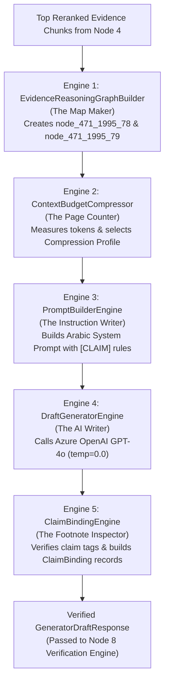

# ✍️ Subsystem Architecture: Generator Engine v1.1 (Node 7)

---

## 📌 Executive Summary & Scope

The **Generator Engine** (`agents/generator.py`) produces factual, zero-hallucination statutory responses by binding every generated legal assertion to an explicit **`EvidenceReasoningGraph`** node (`[CLAIM:node_id]`).

It operates across **5 Cohesive Sub-Engines**:
1. **Engine 1**: `EvidenceReasoningGraphBuilder` (Constructs directional graph of evidence nodes, parent-child links, and cross-references).
2. **Engine 2**: `ContextBudgetCompressor` (Manages token budget dynamically: `FULL`, `LIGHT`, `AGGRESSIVE`, `EMERGENCY`).
3. **Engine 3**: `PromptBuilderEngine` (Constructs structured Arabic legal system prompts with strict claim binding rules).
4. **Engine 4**: `DraftGeneratorEngine` (Executes LLM generation with `temperature = 0.0`).
5. **Engine 5**: `ClaimBindingEngine` (Parses LLM output, binds every statement to evidence graph nodes, and builds `ClaimBinding` records).

---

## 🔄 Pipeline Node Sequence & Trajectory

```mermaid
flowchart LR
    Node0["Node 0:\nDocument Ingestion"] --> Node1["Node 1:\nPlanner Agent"]
    Node1 --> Node2["Node 2:\nQuery Rewriter"]
    Node2 --> Node3["Node 3:\nQdrant Hybrid Retriever"]
    Node3 --> Node4["Node 4:\nCandidate Grouper"]
    Node4 --> Node5["Node 5:\nReranker Agent"]
    Node5 --> Node6["Node 6:\nRelevance Checker"]
    Node6 --> Node7["★ Node 7:\nGenerator Engine"]
    Node7 --> Node8["Node 8:\nVerification Engine"]
    Node8 --> Node9["Node 9:\nResponse Composer"]
    Node9 --> Node10["Node 10:\nCertification Authority"]
```



- **Predecessor (Upstream)**: **Node 6** ([`Relevance_Checker.md`](file:///d:/RagnrAI/project_documentation/architecture/Relevance_Checker.md)) — Evaluates evidence sufficiency & approves direct generation.
- **Current Position**: **Node 7** (Generator Engine) — Constructs Evidence Reasoning Graph & generates factual legal draft with `[CLAIM:node_id]` tags.
- **Successor (Downstream)**: **Node 8** ([`Verification.md`](file:///d:/RagnrAI/project_documentation/architecture/Verification.md)) — 7-Gate audit guardrail & Micro-Repair Engine.

---

## 📖 The Intuitive Story: The Judicial Draftsman

Imagine a Supreme Court Judicial Draftsman writing an official legal opinion:
- The Draftsman is **forbidden** from writing any sentence unless they can point to the exact printed paragraph in the case binder!
- Every time the Draftsman writes a statement (e.g. *"Disciplinary penalties must be logged in the special register"*), they stamp a footnote tag right next to it: **`[CLAIM:node_471_1995_78]`**.
- If a sentence cannot be stamped with a valid node tag, the Draftsman strikes it out immediately.

That Judicial Draftsman is the **Generator Engine**.

---

## ⚙️ 1. Deep-Dive Specification of the 5 Cohesive Sub-Engines



### 1.1 Engine 1: `EvidenceReasoningGraphBuilder` (The Map Maker)
- **Role**: Takes flat, unstructured text chunks from the Reranker Agent and builds a **Structured Evidence Reasoning Graph** (`EvidenceReasoningGraph`).
- **Action**: Assigns a unique node ID to every candidate snippet (e.g. `node_471_1995_78`), extracts parent-child linkages (`previous_article_key`, `next_article_key`), and builds directional relational edges.

### 1.2 Engine 2: `ContextBudgetCompressor` (The Page Counter / Compression Manager)
- **Role**: Manages context token consumption dynamically to prevent LLM prompt overflow or high-latency bottlenecks.
- **Action**: Evaluates total token count across all evidence graph nodes and selects an active **Compression Profile** (`FULL`, `LIGHT`, `AGGRESSIVE`, `EMERGENCY`).

### 1.3 Engine 3: `PromptBuilderEngine` (The Instruction Writer)
- **Role**: Constructs structured Arabic legal system prompts (`PROMPT_TEMPLATE_VERSION = "ARABIC_LEGAL_v1.1"`).
- **Action**: Formats evidence nodes into typed text blocks, injects conversational scope parameters (`ConversationContext`), and appends the mandatory system directive:
  > *"You MUST append `[CLAIM:node_id]` right after EVERY factual legal sentence you generate!"*

### 1.4 Engine 4: `DraftGeneratorEngine` (The AI Writer)
- **Role**: Calls Azure OpenAI (**GPT-4o** initialized with `temperature = 0.0` for 100% factual accuracy).
- **Action**: Generates the initial raw Arabic legal draft containing explicit claim tags.

### 1.5 Engine 5: `ClaimBindingEngine` (The Footnote Inspector)
- **Role**: Inspects every generated sentence, parses `[CLAIM:node_id]` tags, and verifies node existence against Engine 1's Evidence Graph.
- **Action**: Builds structured `ClaimBinding` records (`claim_id`, `statement`, `source_article_key`, `evidence_confidence`). If an ungrounded tag is detected, Engine 5 flags it as an unbound claim and scrubs the statement.

---

## 📌 2. Claim-to-Article Binding Protocol (`[CLAIM:node_id]`)

Nomos AI eliminates LLM hallucination through strict **Deterministic Claim-to-Article Binding**:

- During prompt construction, every evidence chunk is converted into an `EvidenceNode` with a unique graph node ID (e.g. `node_471_1995_78`).
- The LLM is instructed to append `[CLAIM:node_id]` to every generated legal sentence:
  ```text
  المادة 78 من القرار الوزاري رقم 471 لسنة 1995م تنص على وجوب قيد العقوبات الانضباطية في سجل خاص [CLAIM:node_471_1995_78].
  ```
- **Engine 5 (`ClaimBindingEngine`)** validates these tags. If an LLM generates a claim tag referencing a node ID that does NOT exist in the evidence graph, the claim is flagged as unbound (`claims_bound` penalty) and scrubbed!

---

## 📊 3. Dynamic Context Budget Profiles (`ContextBudgetCompressor`)

To prevent LLM context window overflow while preserving critical legal evidence, Engine 2 selects a compression profile based on total token budget:

| Profile Name | Token Threshold | Plain-English Compression Strategy |
| :--- | :---: | :--- |
| 🟢 **`FULL`** | **$< 4,000$ tokens** | Includes full clean text of all top reranked chunks without compression. |
| 🟡 **`LIGHT`** | **$4,000 - 8,000$ tokens** | Truncates general context chunks while preserving 100% of `PRIMARY_OBLIGATION` text. |
| 🟠 **`AGGRESSIVE`** | **$8,000 - 12,000$ tokens** | Summarizes secondary background chunks; keeps only key statutory clauses. |
| 🔴 **`EMERGENCY`** | **$> 12,000$ tokens** | Retains strictly the first 300 characters of top 5 primary chunks. |

---

## 🔄 4. Real-World Step-by-Step Execution Flow Trace

Let's trace a concrete real-world legal query across all 5 sub-engines:

- **User Query**: *"What are the penalties for prison guards who mistreat inmates under Decision 471 of 1995?"*

### Execution Trace Across the 5 Sub-Engines:

1. **Engine 1 (`EvidenceReasoningGraphBuilder`)**:
   - Chunk 1 (Article 78) $\rightarrow$ Creates **Node `node_471_1995_78`** (`role: PRIMARY_OBLIGATION`).
   - Chunk 2 (Article 79) $\rightarrow$ Creates **Node `node_471_1995_79`** (`role: SANCTION_PENALTY`).
   - Connects Node 78 to Node 79 via an `IntraDocLink` relational edge.

2. **Engine 2 (`ContextBudgetCompressor`)**:
   - Total evidence length = **1,200 tokens**.
   - $1,200 < 4,000$ tokens $\rightarrow$ Selects **`CompressionProfile = "FULL"`** (no text cut).

3. **Engine 3 (`PromptBuilderEngine`)**:
   - Constructs the Arabic prompt containing Node 78 and Node 79 snippets.
   - Appends mandatory rule: *"You MUST attach `[CLAIM:node_id]` right after every sentence!"*

4. **Engine 4 (`DraftGeneratorEngine`)**:
   - GPT-4o (`temperature = 0.0`) generates the Arabic draft text:
     > *"وفقاً للمادة 78 من القرار الوزاري رقم 471 لسنة 1995م، يجب قيد كافة العقوبات الانضباطية في سجل خاص **`[CLAIM:node_471_1995_78]`**. وتنص المادة 79 على أنه يُعاقب حارس المنشأة المخالف بالسجن الانفرادي مدة لا تزيد على 5 أيام أو بغرامة قدرها 10,000 درهم **`[CLAIM:node_471_1995_79]`**."*

5. **Engine 5 (`ClaimBindingEngine`)**:
   - Sentence 1: Sees `[CLAIM:node_471_1995_78]`. Verified in Graph! $\rightarrow$ Creates `ClaimBinding` record `CLAIM_001`.
   - Sentence 2: Sees `[CLAIM:node_471_1995_79]`. Verified in Graph! $\rightarrow$ Creates `ClaimBinding` record `CLAIM_002`.
   - Computes Telemetry: `total_claims = 2`, `claims_bound = 2` (**100% Bound!**).

6. **Handoff**: Packages `GeneratorDraftResponse` output object and hands it to Node 8 (Verification Engine).
