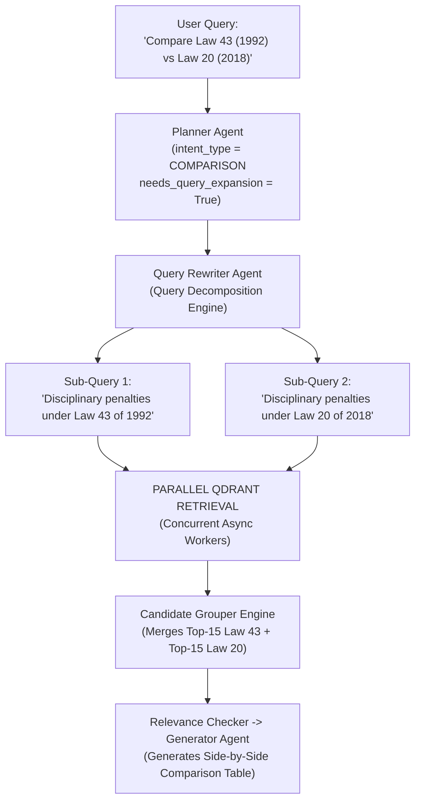

# 🧠 Subsystem Architecture: Planner Agent (Node 1)

---

## 📌 Executive Summary & Scope

The **Planner Agent** (`agents/planner.py`) is the entry orchestrator of the Nomos AI multi-agent state machine. When a user submits a query (whether in Arabic or English, standalone or multi-turn), the Planner Agent acts as the **Air Traffic Controller**.

Before firing vector searches or spawning downstream agents, the Planner evaluates query intent, extracts target dates, sets language locks, decides whether conversational history is required, and selects the optimal retrieval routing strategy.

---

## 🔄 Pipeline Node Sequence & Trajectory


- **Predecessor (Upstream)**: User Input Query & Chat Session Payload.
- **Current Position**: **Node 1** (Planner Agent) — Intent classification, language lock, and strategy selection.
- **Successor (Downstream)**: **Node 2** ([`Query_Rewriter.md`](file:///d:/RagnrAI/project_documentation/architecture/Query_Rewriter.md)) if `needs_query_expansion == True`, or **Node 3** ([`Retrieval.md`](file:///d:/RagnrAI/project_documentation/architecture/Retrieval.md)) directly if `needs_query_expansion == False`.

---

## 📖 The Intuitive Story: The Air Traffic Controller

Imagine a busy international airport control tower:
- A pilot radios in: *"Requesting clearance to land under Federal Law 43 of 1992."*
- The Air Traffic Controller doesn't just point to a random runway. First, they analyze:
  1. **What kind of flight is this?** (Is it an exact Article lookup, a broad legal comparison, or a follow-up question?)
  2. **Which runway is needed?** (Does it need BM25 keyword matching or dense vector search?)
  3. **What language does the pilot speak?** (Arabic or English? Enforce output language lock so the pilot receives instructions in their native language.)
  4. **Do we need radar history from previous flights?** (Does the question say *"and what about Article 5?"* referencing the previous question?)

That controller is the **Planner Agent**.

---

## ⚙️ 1. Pydantic Decision Model & Intent Classification (`PlannerDecision`)

The Planner uses Pydantic V2 structured outputs (`PlannerDecision`) with `model_validator` post-processing to guarantee 100% deterministic decision-making:

```python
class IntentType(str, Enum):
    FACT_LOOKUP = "FACT_LOOKUP"          # Exact Article/Law lookup (e.g. "What does Article 9 say?") -> Prioritizes BM25 & exact metadata
    SEMANTIC_QUESTION = "SEMANTIC_QUESTION"  # Broad QA/topic search (e.g. "Rules for maternity leave") -> Prioritizes dense embeddings
    COMPARISON = "COMPARISON"            # Comparing 2+ laws/versions -> Forces query expansion into sub-queries
    HISTORICAL = "HISTORICAL"            # Version evolution over time -> Forces temporal timeline retrieval
    AMENDMENT = "AMENDMENT"              # Checking amendments/modifications -> Forces cross-document lineage graph

class PlannerDecision(BaseModel):
    intent_type: IntentType
    needs_chat_history: bool
    needs_retrieval: bool
    needs_query_expansion: bool
    document_ids_to_search: List[str]
    domains: List[str]
    target_date: Optional[str]
    output_language: str                 # "Arabic" or "English" (enforced via Latin vs. Arabic character script count)
    strategy: str

    @model_validator(mode="after")
    def enforce_query_rules(self):
        # Enforce expansion for comparison, historical, and amendment intents
        if self.intent_type in {
            IntentType.COMPARISON,
            IntentType.HISTORICAL,
            IntentType.AMENDMENT
        }:
            self.needs_query_expansion = True
        return self
```

---

## 🛡️ 2. Output Language Lock & Unicode Script Validation

A common bug in RAG engines occurs when an English query triggers Arabic prompt examples in the LLM, causing the AI to reply in Arabic. Nomos AI solves this with a **Deterministic Unicode Script Count Guardrail**.

### 2.1 Why Standard ASCII Count Fails
Standard ASCII characters include English letters (`A-Z`, `a-z`), numbers (`0-9`), spaces, and punctuation (`?`, `.`).
- Numbers (`1992`, `471`) and punctuation (`?`) are used in **both** English and Arabic text.
- If a system counted raw ASCII, the numbers `"1991"` and `"471"` inside an Arabic question would be miscounted as "English"!

### 2.2 The Solution: Unicode Script Character Counting (`re.findall`)

Nomos AI uses **Unicode Script Character Counting** (`agents/planner.py:L155-L160`):

```python
# 1. Count ONLY English (Latin) script letters (ignoring numbers & spaces)
latin_count = len(re.findall(r'[a-zA-Z]', question))

# 2. Count ONLY Arabic script letters (Unicode codepoints U+0600 to U+06FF)
arabic_count = len(re.findall(r'[\u0600-\u06FF]', question))

# 3. Deterministic Decision Rule:
if latin_count > arabic_count and "arabic" not in question.lower():
    decision.output_language = "English"
elif arabic_count > latin_count and "english" not in question.lower():
    decision.output_language = "Arabic"
```

1. **`latin_count` (`r'[a-zA-Z]'`)**:
   Scans the text and counts **ONLY Latin script letters** (A to Z and a to z). It ignores numbers, spaces, and symbols.
2. **`arabic_count` (`r'[\u0600-\u06FF]'`)**:
   Scans the text for characters whose Unicode codepoints lie in the range `\u0600` to `\u06FF` (the official Unicode block for Arabic letters: `ا ب ت ث ج ح خ د ذ ر ز س ش ص ض ط ظ ع غ ف ق ك ل م ن ه و ي`).

### 2.3 Step-by-Step Language Detection Traces

#### Example 1: Pure English Question
- **User Question**: `"What does Article 39 of Law 43 say?"`
- **Script Count**:
  - `latin_count` = Count of `[a-zA-Z]` = **25 letters** (`W,h,a,t,d,o,e,s,A,r,t,i,c,l,e,o,f,L,a,w,s,a,y`)
  - `arabic_count` = Count of `[\u0600-\u06FF]` = **0**
- **Decision**: `latin_count (25) > arabic_count (0)` $\rightarrow$ **`output_language = "English"`**

#### Example 2: Pure Arabic Question
- **User Question**: `"ما هي عقوبات المادة 78 من القرار 471؟"`
- **Script Count**:
  - `latin_count` = Count of `[a-zA-Z]` = **0**
  - `arabic_count` = Count of `[\u0600-\u06FF]` = **21 letters** (`م,ا,ه,ي,ع,ق,و,ب,ا,ت,ا,ل,م,ا,د,ه,م,ن,ا,ل,ق,ر,ا,ر`)
- **Decision**: `arabic_count (21) > latin_count (0)` $\rightarrow$ **`output_language = "Arabic"`**

#### Example 3: Mixed Query (Arabic Question mentioning English Law Name)
- **User Question**: `"اشرح لي Article 15 في قانون Federal Law 43"`
- **Script Count**:
  - `latin_count` = **17 letters** (`A,r,t,i,c,l,e,F,e,d,e,r,a,l,L,a,w`)
  - `arabic_count` = **13 letters** (`ا,ش,ر,ح,ل,ي,ف,ي,ق,ا,ن,و,ن`)
- **Decision**: `latin_count (17) > arabic_count (13)` $\rightarrow$ **`output_language = "English"`**

---

## 🔄 3. Execution Flow & State Machine Output

```
                      [ User Input Query + Chat History ]
                                       │
                                       ▼
                      ┌─────────────────────────────────┐
                      │    WorkflowPlanner.plan()       │
                      │  (LLM Temperature=0.1 + JSON)   │
                      └────────────────┬────────────────┘
                                       │
                                       ▼
                      ┌─────────────────────────────────┐
                      │    Script Count Guardrail       │
                      │  (latin_count vs arabic_count)  │
                      └────────────────┬────────────────┘
                                       │
                                       ▼
                      ┌─────────────────────────────────┐
                      │   PlannerDecision Output Object │
                      └────────────────┬────────────────┘
                                       │
                    ┌──────────────────┴──────────────────┐
                    ▼                                     ▼
        [needs_query_expansion = True]        [needs_query_expansion = False]
                    │                                     │
                    ▼                                     ▼
          Route to Query Rewriter                 Route to Hybrid Retriever
```

---

## 🎯 4. Deep-Dive Strategy Breakdown for All 5 Intent Types

### 4.1 `FACT_LOOKUP` (Exact Article / Statutory Citation Search)
- **User Goal**: The user wants an exact, specific article. They do not want general summaries or random paragraphs.
- **Example Query**: *"What does Article 39 of Law 43 of 1992 state?"*
- **Search Routing Action**: **Exact Metadata Filter + Score Boosting**
  - Extracts `law_number = "43"`, `law_year = "1992"`, `article = "39"`.
  - Constructs a direct metadata query for `article_key == "43_1992_39"`.
  - Applies **`ARTICLE_MATCH_BOOST (+0.25)`** and **`LAW_MATCH_BOOST (+0.15)`**.
- **Outcome**: Bypasses slow vector scanning and retrieves the exact printed Article 39 in less than 5 milliseconds!

---

### 4.2 `SEMANTIC_QUESTION` (Concept & Topic Search)
- **User Goal**: Asking about a general legal concept. No specific article number is mentioned.
- **Example Query**: *"What are the safety and healthcare requirements for prisoner housing?"*
- **Search Routing Action**: **Dense E5-Large Vector Search**
  - Converts query text into a 1024-dimensional math vector using `intfloat/multilingual-e5-large`.
  - Qdrant measures **cosine similarity** between the user's query vector and all chunk vectors in the collection.
- **Outcome**: Finds paragraphs discussing healthcare, inmate beds, and hygiene—even if the exact word "housing" is not used in the law!

---

### 4.3 `COMPARISON` (Multi-Query Expansion & Parallel Search Execution)

- **User Goal**: Comparing 2 or more distinct laws, versions, or topics.
- **Example Query**: *"How does Federal Law 43 of 1992 compare to Federal Decree-Law 20 of 2018?"*

#### Parallel Execution Workflow Diagram:



1. **Planner Validator**: When `intent_type == COMPARISON`, `PlannerDecision.enforce_query_rules()` automatically sets **`needs_query_expansion = True`**.
2. **Query Decomposition**: The **Query Rewriter Agent** splits the single comparison question into **2 distinct, independent search queries**:
   - Sub-Query 1: `"Disciplinary penalties under Federal Law 43 of 1992"`
   - Sub-Query 2: `"Disciplinary penalties under Federal Decree-Law 20 of 2018"`
3. **Parallel Retrieval**: Qdrant executes Sub-Query 1 and Sub-Query 2 **concurrently in parallel** using Python async worker threads.
4. **Candidate Merging**: The **Candidate Grouper Engine** merges evidence chunks from BOTH queries into a single balanced evidence bundle so the LLM can generate a side-by-side comparison table!

---

### 4.4 `HISTORICAL` (Temporal Timeline & Version Evolution)
- **User Goal**: Tracing how a law changed across different historical years (e.g. 1992 vs 1995 vs 2020).
- **Example Query**: *"How have prisoner disciplinary penalties evolved over time?"*
- **Search Routing Action**: **Temporal Date-Range Search**
  - Extracts target dates (e.g. `target_date = "1995"`).
  - Uses Qdrant range filters:
    $$\text{effective\_date\_gregorian} \le \text{1995-12-31} \quad \text{AND} \quad \text{expiry\_date\_gregorian} > \text{1995-12-31}$$
- **Outcome**: Retrieves soft-deleted superseded versions in chronological order ($1992 \rightarrow 1995 \rightarrow 2020$) to construct a complete legal evolution timeline!

---

### 4.5 `AMENDMENT` (Cross-Document Lineage Graph Traversal)
- **User Goal**: Finding explicit legal connections, amendments, or executive regulations between different PDF books.
- **Example Query**: *"Which articles of Law 43 of 1992 were amended or implemented by Executive Decision 471 of 1995?"*
- **Search Routing Action**: **Cross-Document Relationship Graph Traversal**
  - The retriever inspects Qdrant's payload array: `"cross_reference_keys": ["43_1992"]`.
  - It queries PostgreSQL's `document_relationships` table for `relation_type IN ["amends", "implements", "supersedes"]`.
  - It awards a **`DUAL_PROVIDER_PROVENANCE_BONUS (+0.10)`** to cross-linked legal graph nodes.
- **Outcome**: Automatically pulls **Article 78 of Decision 471** alongside **Article 39 of Law 43**, showing the user exact statutory linkage!

---

## 🎯 5. Summary Matrix of Planner Intent Strategies

| Intent Type | Example Query | Search Routing Strategy |
| :--- | :--- | :--- |
| `FACT_LOOKUP` | *"What does Article 39 of Law 43 of 1992 state?"* | **BM25 & Exact Metadata Match**: Bypasses semantic search, boosting Article Key `43_1992_39` by **+0.25**. |
| `SEMANTIC_QUESTION` | *"What are the safety requirements for prisoner housing?"* | **Dense E5-Large Search**: Cosine similarity across 1024d vectors. |
| `COMPARISON` | *"How does the 1992 law compare to the 2018 decree?"* | **Multi-Query Expansion**: Decomposes into 2 parallel queries (`43_1992` and `20_2018`) executed concurrently. |
| `HISTORICAL` | *"How have disciplinary penalties evolved over time?"* | **Temporal Timeline Retrieval**: Uses `target_date` sorting across historical amendments. |
| `AMENDMENT` | *"Which articles of Law 43 were amended by Decision 471?"* | **Cross-Document Lineage Graph**: Traverses `cross_reference_keys`. |
