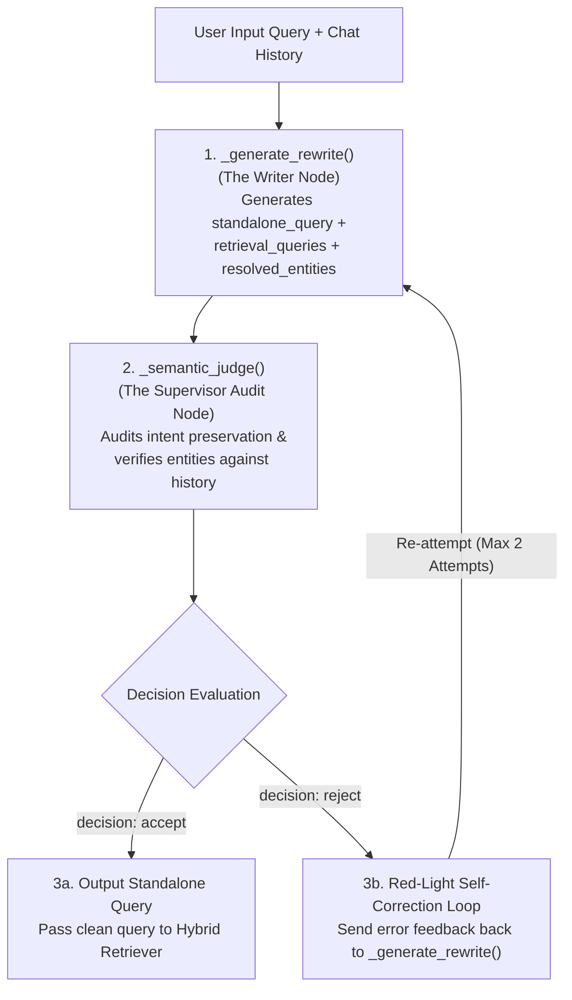

# ✏️ Subsystem Architecture: Query Rewriter Agent (Node 2)

---

## 📌 Executive Summary & Scope

The **Query Rewriter Agent** (`agents/query_rewriter.py`) is responsible for resolving multi-turn conversational ambiguities, pronouns (`"it"`, `"this"`, `"these"`), and decomposing complex multi-topic questions into clean, independent retrieval queries.

It features a **Self-Correction Feedback Loop** powered by an internal **Semantic Judge** (`_semantic_judge()`) that verifies reference resolution against chat history before handing rewritten queries to the retriever.

---

## 🔄 Pipeline Node Sequence & Trajectory


- **Predecessor (Upstream)**: **Node 1** ([`Planner.md`](file:///d:/RagnrAI/project_documentation/architecture/Planner.md)) — Evaluates query intent & sets `needs_query_expansion = True`.
- **Current Position**: **Node 2** (Query Rewriter Agent) — Resolves pronouns, prevents hallucinations, decomposes multi-topic queries.
- **Successor (Downstream)**: **Node 3** ([`Retrieval.md`](file:///d:/RagnrAI/project_documentation/architecture/Retrieval.md)) — Passes clean `standalone_query` and decomposed `retrieval_queries` to Qdrant Hybrid Retriever.

---

## 📖 The Intuitive Story: The Courtroom Translator

Imagine a fast-paced trial in a courtroom:
- User (Lawyer): *"What is the penalty under Article 39 of Law 43 of 1992?"*
- Assistant (Judge): *"It requires 5 days of solitary confinement and logging in the special register."*
- User (Lawyer): *"What about Article 40? Does **it** require notification to the prosecution too?"*

If you pass *"Does **it** require notification to the prosecution too?"* straight to Qdrant, the search engine has no idea what **"it"** refers to!

The **Query Rewriter Agent** acts as the Courtroom Translator. It reads the previous turn, replaces **"it"** with **"Article 40 of Federal Law No. 43 of 1992"**, and rewrites the query to:
> *"Does Article 40 of Federal Law No. 43 of 1992 require notification to the public prosecution?"*

---

## ⚙️ 1. Dual-Loop Architecture & Semantic Judge Verification



### 1.1 Detailed Node-by-Node Explanation

#### Node 1: `_generate_rewrite()` (The Writer Node)
When a user asks a follow-up question containing ambiguous pronouns (e.g. *"What are the exceptions to it?"*), this node reads the current question and conversational history to generate **3 outputs**:
- **`standalone_query`**: A single, complete question with zero pronouns (`"What are the legal exceptions to disciplinary penalties under Ministerial Decision 471 of 1995?"`).
- **`retrieval_queries`**: A list of clean search queries to execute against Qdrant (split into two sub-queries if comparing laws).
- **`resolved_entities`**: A list of explicit statutory names swapped into the text (`["disciplinary penalties", "Ministerial Decision 471 of 1995"]`).

#### Node 2: `_semantic_judge()` (The Supervisor Audit Node)
Before sending the rewritten query to Qdrant, the **Supervisor Audit Node** inspects the draft and evaluates 2 critical rules:
1. **Rule 1: Intent Preservation (`preserves_intent`)**:
   Checks whether the rewritten query asks the exact same core question. If the Writer altered the user's core intent (e.g. changing "penalties" to "promotions"), the judge flags an `INTENT_MUTATED` warning.
2. **Rule 2: Entity Grounding Verification (`resolved_references`)**:
   Verifies that every single entity claimed in `resolved_entities` exists explicitly in the `chat_history`. If the Writer introduced an ungrounded entity (e.g. "Labor Law 2020") that exists NOWHERE in the history, the judge rejects the rewrite.

#### Node 3a: `[decision = "accept"]` (Green Light Path)
- **Execution**: The Supervisor approves the rewrite (`"decision": "accept"`).
- **Action**: The clean `standalone_query` and `retrieval_queries` are immediately passed to the **Qdrant Hybrid Retriever** to execute vector search.

#### Node 3b: `[decision = "reject"]` (Red Light Self-Correction Loop)
- **Execution**: The Supervisor rejects the rewrite (`"decision": "reject"`).
- **Action**: The system loops back to Node 1 (`_generate_rewrite()`), passing an explicit failure feedback message:
  ```json
  {
    "type": "HALLUCINATION",
    "severity": "error",
    "message": "Entity 'Labor Law 2020' was claimed in resolved_entities but exists nowhere in chat_history. Fix this and try again."
  }
  ```
- The Writer uses this feedback to generate a clean, corrected rewrite (up to a maximum of 2 attempts).

---

## 🛠️ 2. Key Guardrail Rules in `QueryRewriter`

1. **Pronoun & Entity Resolution**:
   Replaces ambiguous pronouns (`"it"`, `"this"`, `"these"`, `"the regulation"`) with explicit statutory titles found in `chat_history`.
   - *Before*: *"What are the penalties under **it**?"*
   - *After*: *"What are the penalties under **Federal Law No. 43 of 1992**?"*

2. **True Hallucination Prevention**:
   The `_semantic_judge()` checks if any newly introduced entity exists NOWHERE in the question AND NOWHERE in the history. If an ungrounded entity is detected, the judge rejects the rewrite (`decision: "reject"`).

3. **Query Decomposition**:
   If a user asks a comparison or multi-topic question (e.g. *"Compare penalties in Law 43 of 1992 vs Law 20 of 2018"*), the rewriter decomposes it into multiple `retrieval_queries`:
   - Query 1: `"Penalties in Federal Law 43 of 1992"`
   - Query 2: `"Penalties in Federal Decree-Law 20 of 2018"`

---

## 🎯 3. Concrete Rewrite Transformation & Output Schema Example

Let's trace a real 2-turn conversation:

- **Turn 1 (History)**:
  - *User*: *"Tell me about disciplinary penalties under Ministerial Decision 471 of 1995."*
  - *Assistant*: *"Decision 471 outlines prison inmate discipline, health checks, and registry logging."*
- **Turn 2 (Current User Input)**:
  - *User*: *"What are the exceptions to it?"*

### Step-by-Step System Output Payload:

```json
{
  "standalone_query": "What are the legal exceptions to disciplinary penalties under Ministerial Decision 471 of 1995?",
  "retrieval_queries": [
    "Legal exceptions to disciplinary penalties under Ministerial Decision 471 of 1995"
  ],
  "resolved_entities": [
    "disciplinary penalties",
    "Ministerial Decision 471 of 1995"
  ],
  "semantic_judge_result": {
    "preserves_intent": true,
    "resolved_references": {
      "it": {
        "resolved_to": "disciplinary penalties under Ministerial Decision 471 of 1995",
        "source": "conversation_history"
      }
    },
    "issues": [],
    "decision": "accept"
  }
}
```
