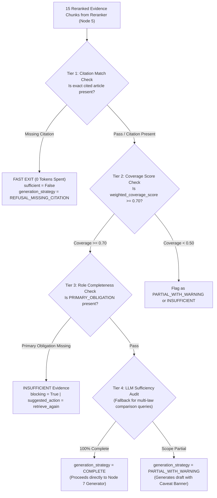

# 🛡️ Subsystem Architecture: Relevance Checker Engine v3.1 (Node 6)

---

## 📌 Executive Summary & Scope

The **Relevance Checker Engine** (`agents/relevance_checker.py`) is the **Quality Gatekeeper & Sufficiency Audit Gate** of Nomos AI.

Before any evidence is passed to the Generator Agent to write an answer, the Relevance Checker inspects the retrieved chunks and evaluates whether the evidence is legally **COMPLETE**, **PARTIAL**, or **INSUFFICIENT**. If evidence is missing critical statutory clauses (e.g. missing Law 2 in a comparison query), the Relevance Checker blocks generation and triggers re-retrieval or orders a controlled refusal.

---

## 🔄 Pipeline Node Sequence & Trajectory

```mermaid
flowchart LR
    Node0["Node 0:\nDocument Ingestion"] --> Node1["Node 1:\nPlanner Agent"]
    Node1 --> Node2["Node 2:\nQuery Rewriter"]
    Node2 --> Node3["Node 3:\nQdrant Hybrid Retriever"]
    Node3 --> Node4["Node 4:\nCandidate Grouper"]
    Node4 --> Node5["Node 5:\nReranker Agent"]
    Node5 --> Node6["★ Node 6:\nRelevance Checker"]
    Node6 --> Node7["Node 7:\nGenerator Engine"]
    Node7 --> Node8["Node 8:\nVerification Engine"]
    Node8 --> Node9["Node 9:\nResponse Composer"]
    Node9 --> Node10["Node 10:\nCertification Authority"]
```

- **Predecessor (Upstream)**: **Node 5** ([`Reranker.md`](file:///d:/RagnrAI/project_documentation/architecture/Reranker.md)) — Categorizes candidate chunks into Evidence Roles (`PRIMARY_OBLIGATION`, `SANCTION_PENALTY`).
- **Current Position**: **Node 6** (Relevance Checker Engine) — Audit sufficiency evaluation & completeness checks.
- **Successor (Downstream)**: **Node 7** ([`Generator.md`](file:///d:/RagnrAI/project_documentation/architecture/Generator.md)) — Constructs Evidence Reasoning Graph & generates factual legal draft.

---

## 📖 The Intuitive Story: The Chief Audit Prosecutor

Imagine a Chief Audit Prosecutor reviewing a case file before signing off on a trial:
- Reranker: *"Here are the top 5 reranked evidence clips."*
- Chief Audit Prosecutor (**Relevance Checker**):
  - *"Wait! The user asked to compare Law 43 of 1992 with Decree 20 of 2018."*
  - *"You brought me 5 clips from Law 43, but **ZERO clips from Decree 20**!"*
  - *"Decision: `sufficient = False`, `generation_strategy = REFUSAL_MISSING_CITATION`!"*

The Relevance Checker prevents half-baked, incomplete, or hallucinated legal answers from reaching the user.

---

## ⚙️ 1. Multi-Tier Decision Hierarchy (`RelevanceDecision`)

The Relevance Checker executes a **4-Tier Decision Hierarchy**. Tiers 1, 2, and 3 use **Fast Python Code (0 LLM tokens, 0ms API cost)** to save latency and money. Only complex edge-case queries proceed to Tier 4 (LLM Semantic Audit).

---

## 🔍 2. Deep-Dive Specification of the 4 Tiers

### 2.1 Tier 1: Citation Match Check (Fast Exit Rule — 0 Tokens Spent)
- **Role**: Validates whether an exact article explicitly requested by the user is physically present in the retrieved evidence chunks.
- **Mechanism**: If the user query mentions an exact article (e.g. `has_citation == True` and `exact_citation_key == "43_1992_39"`), Tier 1 scans the metadata of all 15 chunks.
  - **Found**: Passes immediately to Tier 2.
  - **Missing**: Triggers **FAST EXIT** with `sufficient = False`, `generation_strategy = "REFUSAL_MISSING_CITATION"`, and `failure_taxonomy = "ARTICLE_NOT_FOUND"`.
- **Real Example**: User asks for Article 39. Qdrant returns Articles 14, 15, and 16. Tier 1 sees Article 39 is missing and immediately triggers a controlled refusal without wasting LLM tokens!

---

### 2.2 Tier 2: Coverage Score Check (`weighted_coverage_score >= 0.70`)
- **Role**: Deterministically measures whether the retrieved evidence package covers enough required legal evidence roles.
- **Role Weighting Coefficients** (`DeterministicFeatureEngine`):
  - `PRIMARY_OBLIGATION` = **`0.50`** (Core statutory mandate)
  - `SANCTION_PENALTY` = **`0.20`** (Penalties / fines)
  - `EXCEPTION_CLAUSE` = **`0.15`** (Exceptions)
  - `PROCEDURAL_RULE` = **`0.10`** (Filing timelines)
  - `DEFINITION` = **`0.05`** (Statutory definitions)
- **Formula**:
  $$\text{weighted\_coverage\_score} = \frac{\sum \text{Weights of Found Roles}}{\sum \text{Weights of Required Roles}}$$
- **Rule**: If `weighted_coverage_score >= 0.70`, passes to Tier 3. If $< 0.50$, flags evidence as `PARTIAL` or `INSUFFICIENT`.

---

### 2.3 Tier 3: Role Completeness Check (`PRIMARY_OBLIGATION` Audit)
- **Role**: Audits the presence of the single most critical evidence role (`PRIMARY_OBLIGATION`).
- **Mechanism**: A legal answer cannot exist without the core legal obligation!
  - If `PRIMARY_OBLIGATION` is present $\rightarrow$ Passes to Tier 4.
  - If `PRIMARY_OBLIGATION` is missing $\rightarrow$ Marks `blocking = True`, creates an `EvidenceGap` record (`importance = "CRITICAL"`), and sets `sufficiency_level = "INSUFFICIENT"`.

---

### 2.4 Tier 4: LLM Sufficiency Audit (Hybrid LLM Fallback)
- **Role**: A fallback LLM judge (GPT-4o) evaluates complex, ambiguous, or multi-law comparison queries that passed Tiers 1–3.
- **Mechanism**: For multi-law comparison queries (e.g. *"Compare maternity leave in Law 43 of 1992 vs Decree 20 of 2018"*), the LLM verifies that evidence clips exist for **BOTH** laws ($1992$ and $2018$).
  - If both laws are present $\rightarrow$ `sufficiency_level = "COMPLETE"`, `generation_strategy = "COMPARISON"`.
  - If 1 law is missing $\rightarrow$ `sufficiency_level = "PARTIAL"`, `generation_strategy = "PARTIAL_WITH_WARNING"`.

---

## 🎯 3. Sufficiency Classifications & Generation Strategy Matrix

| Sufficiency Level | Decision Criteria | Downstream Action |
| :--- | :--- | :--- |
| **`COMPLETE`** | 100% of required statutory clauses & articles are present. | `COMPLETE` $\rightarrow$ Proceeds directly to **Node 7 (Generator Engine)** to write full answer. |
| **`PARTIAL`** | Core rule is present, but secondary context or decree is missing. | `PARTIAL_WITH_WARNING` $\rightarrow$ Generates draft with mandatory **Caveat Warning Banner** attached. |
| **`INSUFFICIENT`** | Key cited article or compared law is completely missing. | `REFUSAL_MISSING_CITATION` $\rightarrow$ **Blocks Generation** and triggers re-retrieval loop or controlled refusal. |
