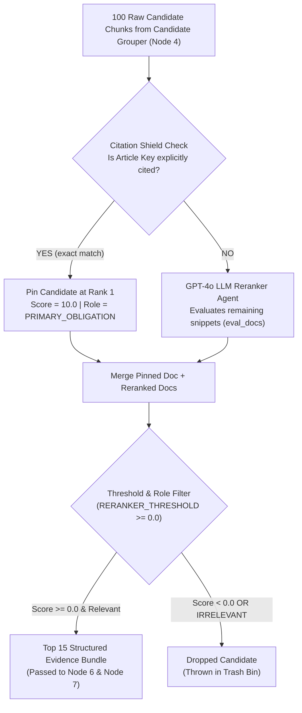

# 📊 Subsystem Architecture: Reranker Agent (Node 5)

---

## 📌 Executive Summary & Scope

The **Reranker Agent** (`agents/reranker.py`) calibrates raw retrieval scores by assigning **Evidence Roles** (`PRIMARY_OBLIGATION`, `EXCEPTION_CLAUSE`, `SANCTION_PENALTY`, etc.) and enforcing the **Citation Shield Protocol**.

It transforms a raw list of candidate vector matches into an ordered, categorized legal evidence bundle tailored for the downstream Generator Agent.

---

## 🔄 Pipeline Node Sequence & Trajectory

```mermaid
flowchart LR
    Node0["Node 0:\nDocument Ingestion"] --> Node1["Node 1:\nPlanner Agent"]
    Node1 --> Node2["Node 2:\nQuery Rewriter"]
    Node2 --> Node3["Node 3:\nQdrant Hybrid Retriever"]
    Node3 --> Node4["Node 4:\nCandidate Grouper"]
    Node4 --> Node5["★ Node 5:\nReranker Agent"]
    Node5 --> Node6["Node 6:\nRelevance Checker"]
    Node6 --> Node7["Node 7:\nGenerator Engine"]
    Node7 --> Node8["Node 8:\nVerification Engine"]
    Node8 --> Node9["Node 9:\nResponse Composer"]
    Node9 --> Node10["Node 10:\nCertification Authority"]
```



- **Predecessor (Upstream)**: **Node 4** ([`Candidate_Grouper.md`](file:///d:/RagnrAI/project_documentation/architecture/Candidate_Grouper.md)) — Merges sliding sub-windows & purges duplicate text snippets.
- **Current Position**: **Node 5** (Reranker Agent) — Assigning Evidence Roles & Citation Shield.
- **Successor (Downstream)**: **Node 6** ([`Relevance_Checker.md`](file:///d:/RagnrAI/project_documentation/architecture/Relevance_Checker.md)) — Audit sufficiency evaluation & completeness checks.

---

## 📖 The Intuitive Story: The Senior Legal Analyst

Imagine a senior legal analyst receiving 75 raw document clips from a junior researcher:
- Junior Researcher: *"Here are 75 paragraphs that matched the keywords!"*
- Senior Legal Analyst: *"Hold on. Let's organize these logically before briefing the judge."*
  1. *"Clip #1 is the **Primary Obligation** (the core rule)."*
  2. *"Clip #2 is the **Exception Clause** (when the rule does not apply)."*
  3. *"Clip #3 is the **Sanction Penalty** (the fine/imprisonment for violating the rule)."*
  4. *"Clip #4 is **Irrelevant** (throw it out)."*

That senior analyst is the **Reranker Agent**.

---

## 🤖 1. Model Specifications & Dual-Layer Reranking Engine

Nomos AI implements a **Dual-Layer Reranking Architecture**:

1. **Primary LLM Reranker Agent (`agents/reranker.py`)**:
   - Model: **GPT-4o / GPT-4o-mini** initialized with `temperature=0.0` for 100% deterministic precision.
   - Evaluates candidate snippets concurrently and returns structured Pydantic JSON payloads (`EvidenceSetRerankResult`) containing `relevance_score` (`0.0`–`10.0`), `evidence_role`, and `reason`.
2. **Fast Cross-Encoder Fallback (`retriever/builder.py`)**:
   - Model: **FlashRank** (`ms-marco-MiniLM-L-6-v2`) for fast CPU-based cross-encoder reranking of English queries.

---

## 🛡️ 2. The Citation Shield Protocol

If the user explicitly asked about an exact article (e.g. *"What does Article 39 of Law 43 say?"*), standard LLM rerankers sometimes misrank exact matches in favor of longer, wordier articles.

To prevent this, Nomos AI implements the **Citation Shield Protocol** (`agents/reranker.py:L73-L86`):
- If `has_citation == True` and `exact_citation_key` matches candidate `0`, the candidate is **pinned at Rank 1 with a score of 10.0**.
- The LLM reranker evaluates only remaining candidates (`eval_docs = documents[1:10]`), ensuring the exact statutory match can **never be demoted**.

```python
if has_citation and exact_citation_key:
    top_key = documents[0].metadata.get("article_key")
    if top_key == exact_citation_key:
        pinned_doc = documents[0]
        pinned_doc.metadata["rerank_score"] = 10.0
        pinned_doc.metadata["rerank_reason"] = "Citation Shield: Exact Statutory Match Pinned at Rank 1"
        pinned_doc.metadata["evidence_role"] = "PRIMARY_OBLIGATION"
        pinned_doc.metadata["citation_shield_used"] = True
```

---

## 🏷️ 3. Evidence Role Classifications (`CandidateEvidenceRole`)

Every candidate chunk is assigned an explicit legal evidence role:

| Evidence Role | Plain-English Legal Meaning | Real Statutory Text Example | Priority Weight |
| :--- | :--- | :--- | :---: |
| 🟢 **`PRIMARY_OBLIGATION`** | **Core statutory mandate or right.** | *"Inmates shall be allowed 1 hour of exercise daily."* | **Rank 1** |
| 🟡 **`EXCEPTION_CLAUSE`** | **Qualifying condition or exception.** | *"Except when medical isolation is ordered by a doctor."* | **Rank 2** |
| 🔴 **`SANCTION_PENALTY`** | **Penalties, fines, or imprisonment.** | *"Violators shall be punished by a fine of 10,000 AED."* | **Rank 3** |
| 🔵 **`PROCEDURAL_RULE`** | **Filing rules, timelines, registration.** | *"Reports must be submitted within 48 hours to prosecution."* | **Rank 4** |
| 🟣 **`DEFINITION`** | **Statutory term definitions.** | *"For the purpose of this law, 'Director' means..."* | **Rank 5** |
| ⚪ **`SUPPORTING_CONTEXT`** | **General background context.** | *"Penal institutions were updated across all Emirates."* | **Rank 6** |
| ❌ **`IRRELEVANT`** | **Off-topic or non-applicable text.** | *"Office supplies pricing schedule for prison desks."* | **Dropped** |

---

## 📏 4. Score Scale & Threshold Filtering (`RERANKER_THRESHOLD = 0.0`)

Candidates evaluated by the Reranker receive a score on a **0.0 to 10.0 relevance scale**:

- **`10.0`**: **Exact Statutory Citation Match** (Pinned by Citation Shield).
- **`7.0` – `9.9`**: **High Relevance** (Contains the primary legal rule or sanction).
- **`4.0` – `6.9`**: **Medium Relevance** (Provides supporting context or definitions).
- **`0.0` – `3.9`**: **Low Relevance** (Barely related background info).
- **Below `0.0` / `IRRELEVANT`**: **Off-Topic Noise / Garbage**.

### Threshold Enforcement:
- **`RERANKER_THRESHOLD = 0.0`**: Any candidate scoring $\ge 0.0$ is kept in the evidence set.
- **Garbage Filter**: Any candidate scoring $< 0.0$ or tagged `IRRELEVANT` is automatically dropped to prevent LLM hallucinations.

---

## 🔄 5. End-to-End Reranking Execution Flow


