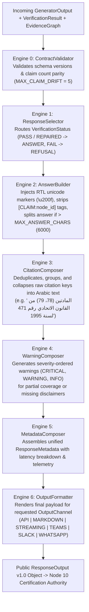
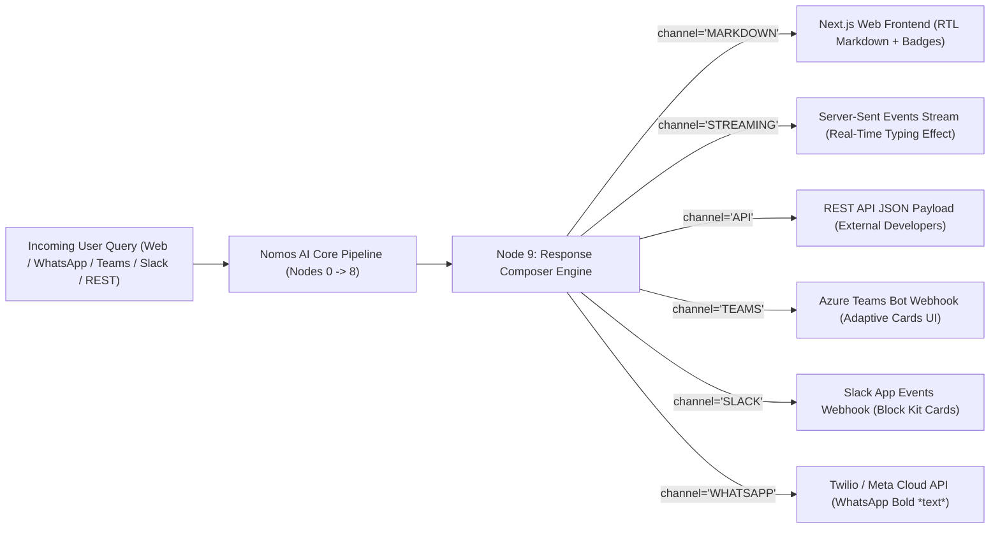

# 🎨 Subsystem Architecture: Response Composer Engine v1.0 (Node 9)

---

## 📌 Executive Summary & Scope

The **Response Composer Engine** (`agents/composer.py`) formats verified legal outputs into clean, user-facing responses for web, markdown, SSE streaming, and enterprise chat applications.

**CRITICAL INVARIANT**: **The Response Composer uses NO LLM (Zero External API Calls)**. It is a 100% deterministic presentation engineering pipeline executing 7 specialized sub-engines.

---

## 🔄 Pipeline Node Sequence & Trajectory

```mermaid
flowchart LR
    Node0["Node 0:\nDocument Ingestion"] --> Node1["Node 1:\nPlanner Agent"]
    Node1 --> Node2["Node 2:\nQuery Rewriter"]
    Node2 --> Node3["Node 3:\nQdrant Hybrid Retriever"]
    Node3 --> Node4["Node 4:\nCandidate Grouper"]
    Node4 --> Node5["Node 5:\nReranker Agent"]
    Node5 --> Node6["Node 6:\nRelevance Checker"]
    Node6 --> Node7["Node 7:\nGenerator Engine"]
    Node7 --> Node8["Node 8:\nVerification Engine"]
    Node8 --> Node9["★ Node 9:\nResponse Composer"]
    Node9 --> Node10["Node 10:\nCertification Authority"]
```



- **Predecessor (Upstream)**: **Node 8** ([`Verification.md`](file:///d:/RagnrAI/project_documentation/architecture/Verification.md)) — 7-Gate audit guardrail & Micro-Repair Engine.
- **Current Position**: **Node 9** (Response Composer Engine) — Zero-LLM deterministic presentation engine & multi-channel formatting.
- **Successor (Downstream)**: **Node 10** ([`Certification.md`](file:///d:/RagnrAI/project_documentation/architecture/Certification.md)) — Cryptographic SHA256 hashing & certified response issuance.

---

## 📖 The Intuitive Story: The Chief Legal Publisher

Imagine the Chief Executive Publisher of an official government legal gazette:
- The legal opinion has been audited and approved by the Supreme Court Appeals Board.
- The Publisher's job is **strictly presentation**:
  1. Add proper RTL (Right-to-Left) typography formatting for Arabic text.
  2. Group, deduplicate, and format citation footnotes at the bottom of the page (`[1]`, `[2]`).
  3. Attach official warning banners if any clause was marked partial.
  4. Format the final output cleanly for web, PDF print, or SSE streaming.

That publisher is the **Response Composer Engine**.

---

## ⚙️ 1. The 7 Deterministic Sub-Engines (`agents/composer.py`)



---

## 🔍 2. Deep-Dive Specification of the 7 Sub-Engines

### 2.1 Engine 0: `ContractValidator`
- **Role**: Pre-composition internal consistency gate.
- **Mechanism**: Ensures upstream schemas match frozen contract definitions (`COMPOSER_CONTRACT_VERSION = "1.0"`). Verifies that claim counts between Generator and Verifier do not drift beyond `MAX_CLAIM_DRIFT = 5`.

---

### 2.2 Engine 1: `ResponseSelector`
- **Role**: Maps upstream verification status to public response status:
  - `VerificationStatus == "PASS"` or `"PASS_WITH_WARNINGS"` or `"REPAIRED"` $\rightarrow$ `ResponseStatus = "ANSWER"`
  - Upstream strategy `PARTIAL_WITH_WARNING` $\rightarrow$ `ResponseStatus = "PARTIAL_ANSWER"`
  - `VerificationStatus == "FAIL"` $\rightarrow$ `ResponseStatus = "REFUSAL"`

---

### 2.3 Engine 2: `AnswerBuilder`
- **Role**: Cleans and normalizes Arabic markdown text:
  - **RTL Typography Safety**: Injects Right-to-Left unicode direction marks (`\u200f`) before Arabic punctuation to prevent visual reversal in web browsers.
  - **Internal Tag Stripping**: Strips internal reasoning graph markers (`[CLAIM:node_id]`) from user-visible text.
  - **Deterministic Splitting**: If answer text exceeds `MAX_ANSWER_CHARS = 6000`, splits text cleanly at sentence boundaries into logical sub-paragraphs.

---

### 2.4 Engine 3: `CitationComposer`
- **Role**: Merges, deduplicates, and formats raw statutory metadata keys into canonical Arabic legal citation footers.
- **Example Conversion**:
  - Raw Keys: `["471_1995_78_win0", "471_1995_78_win1", "471_1995_79"]`
  - Formatted Arabic Footnote: **`"المادتين (78، 79) من القانون الاتحادي رقم 471 لسنة 1995"`**

---

### 2.5 Engine 4: `WarningComposer`
- **Role**: Assembles severity-ordered warnings (`CRITICAL`, `WARNING`, `INFO`).
- **Example Warning Banner**:
  - `"- تنبيه: هذه الإجابة مبنية على تغطية جزئية للنصوص القانونية المتوفرة في قاعدة البيانات."`

---

### 2.6 Engine 5: `MetadataComposer`
- **Role**: Assembles a unified `ResponseMetadata` telemetry block:
  - Latency breakdown (`retrieval_latency_ms`, `rerank_latency_ms`, `generation_latency_ms`, `verification_latency_ms`, `composition_latency_ms`).
  - Graph statistics (`graph_nodes`, `graph_edges`, `claims_verified`, `laws_used`).

---

### 2.7 Engine 6: `OutputFormatter`
- **Role**: Converts the structured `ResponseOutput` into the exact format requested by the client channel.

---

## 🛠️ 3. Multi-Channel Output Formatter Specifications (`OutputChannel`)

| Channel | Target Platform | Rendering Specifications | Code Location |
| :--- | :--- | :--- | :--- |
| **`MARKDOWN`** | Next.js Web UI (`frontend/src/app/page.tsx`) | Renders GFM Markdown with Arabic RTL wrapper styling and collapsable citation blocks. | `agents/composer.py:L710` |
| **`STREAMING`** | Server-Sent Events (SSE API) | Formats output into JSON SSE event chunks (`data: {...}`) for real-time typing effect in `api/query_router.py`. | `agents/composer.py:L745` |
| **`API`** | REST API Clients | Returns raw, un-rendered JSON payload matching frozen `ResponseOutput v1.0` schema. | `agents/composer.py:L680` |
| **`TEAMS` / `SLACK`** | Corporate Chat Apps | Generates Microsoft Teams Adaptive Cards or Slack Block Kit JSON cards with citation buttons. | `agents/composer.py:L780` |
| **`WHATSAPP`** | Messaging Gateways | Strips markdown header tags (`#`) and converts formatting to WhatsApp bold (`*text*`) syntax. | `agents/composer.py:L820` |

---

## 📦 4. Public Data Contract: `ResponseOutput v1.0`

```json
{
  "schema_version": "1.0",
  "response_status": "ANSWER",
  "answer_text": "بناءً على أحكام المادة (78) من القانون الاتحادي...",
  "citations": [
    {
      "citation_key": "471_1995_78",
      "law_title": "قانون المنشآت العقابية",
      "law_number": "471",
      "law_year": "1995",
      "articles": ["78"],
      "formatted": "المادة (78) من القانون الاتحادي رقم 471 لسنة 1995"
    }
  ],
  "warnings": [],
  "metadata": {
    "confidence": 0.94,
    "verification_score": 1.0,
    "total_latency_ms": 420.5,
    "verification_status": "PASS"
  }
}
```

---

## 🔌 5. Multi-Channel Integration Architecture & Developer Workflows

Nomos AI operates as an **Autonomous Intelligence Engine**. It does **NOT** store personal user credentials for WhatsApp, Slack, or Microsoft Teams inside the core AI engine. 

Instead, the Response Composer generates **channel-ready presentation payloads** that can be immediately piped into external gateway webhooks:



### 5.1 Step-by-Step Developer Setup Guides

#### A. 💬 WhatsApp Integration Guide (`channel = "WHATSAPP"`)
1. **Payload Specification**: OutputFormatter converts `#` markdown headers to WhatsApp bold text (`*المادة 78*`) and strips complex HTML tags.
2. **Integration Steps**:
   - Register a WhatsApp Business number via **Meta Cloud API** or **Twilio Messaging API**.
   - Configure Twilio's incoming webhook URL to point to Nomos AI's `/api/v1/query` endpoint.
   - When a user sends a message, Twilio posts the text to Nomos AI; Nomos AI returns `{"channel": "WHATSAPP", "text": "..."}` which Twilio delivers directly back to the WhatsApp chat!

#### B. 🏢 Microsoft Teams Integration Guide (`channel = "TEAMS"`)
1. **Payload Specification**: OutputFormatter builds native **Microsoft Adaptive Card JSON** (`{ "type": "AdaptiveCard", "body": [...] }`).
2. **Integration Steps**:
   - Create a Bot Registration in **Azure Bot Service**.
   - Add the Bot App to your company's Microsoft Teams Admin Center.
   - Set the Azure Bot Messaging endpoint to Nomos AI; Nomos AI returns Adaptive Cards containing interactive citation buttons.

#### C. ⚡ Slack Integration Guide (`channel = "SLACK"`)
1. **Payload Specification**: OutputFormatter generates **Slack Block Kit JSON** (`{ "blocks": [...] }`).
2. **Integration Steps**:
   - Create a Slack App at `api.slack.com` and generate a **Bot User OAuth Token**.
   - Enable Event Subscriptions for `app_mention` and `/nomos` slash commands pointing to Nomos AI.
