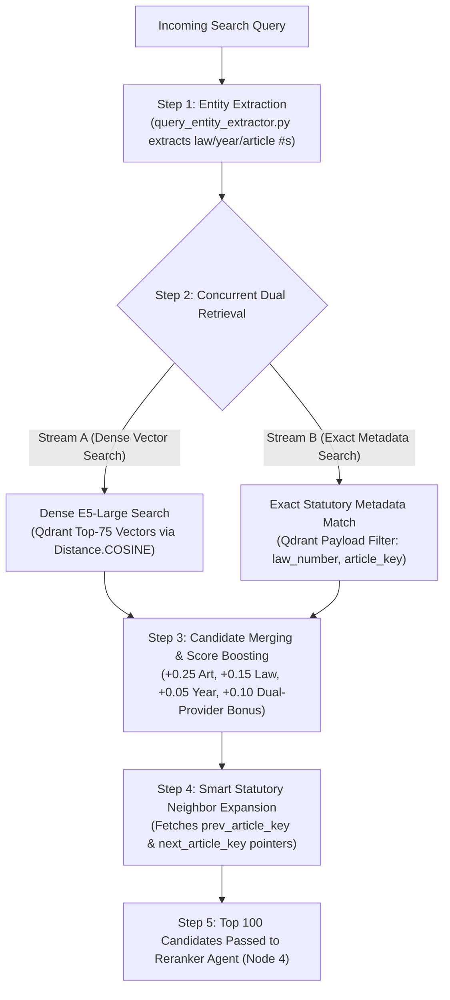

# 🔍 Subsystem Architecture: Qdrant Hybrid Retriever (Node 3)

---

## 📌 Executive Summary & Scope

The **Qdrant Hybrid Retriever** (`retriever/builder.py`) is the dual-engine evidence retrieval subsystem of Nomos AI. 

Rather than relying purely on vector similarity (which frequently misses exact statutory numbers) or pure keyword search, the Hybrid Retriever executes **Dual-Provider Retrieval**:
1. **Dense Vector Search**: Retrieves Top-75 candidates using `intfloat/multilingual-e5-large` 1024d embeddings (`VECTOR_SEARCH_K = 75`).
2. **Exact Statutory Metadata Search**: Concurrently queries Qdrant payload indices for exact `law_number`, `law_year`, `article_number`, and `article_key` matches (`METADATA_SEARCH_K = 50`).

Candidates from both streams are merged, provenance-scored, and expanded using **Smart Statutory Neighbor Expansion**.

---

## 🔄 Pipeline Node Sequence & Trajectory


- **Predecessor (Upstream)**: **Node 2** ([`Query_Rewriter.md`](file:///d:/RagnrAI/project_documentation/architecture/Query_Rewriter.md)) or **Node 1** ([`Planner.md`](file:///d:/RagnrAI/project_documentation/architecture/Planner.md)) directly if query expansion is false.
- **Current Position**: **Node 3** (Qdrant Hybrid Retriever) — Dual-provider search (Dense Top-75 + Exact Metadata Top-50).
- **Successor (Downstream)**: **Node 4** ([`Candidate_Grouper.md`](file:///d:/RagnrAI/project_documentation/architecture/Candidate_Grouper.md)) — Consolidates sliding sub-windows & purges duplicate snippets.

---

## 📖 The Intuitive Story: The Dual-Search Detective

Imagine a detective investigating a legal case:
- Detective Eye #1 (**Dense Vector Search**): Looks for conceptual meaning. *"Find all paragraphs discussing prison discipline and solitary confinement."*
- Detective Eye #2 (**Exact Statutory Metadata Match**): Looks for exact numbers. *"Find the exact folder marked `Law 471` and `Article 78`."*

If only Eye #1 is used, it might retrieve general paragraphs about discipline while missing the exact executive regulation. If only Eye #2 is used, it might miss related clauses that don't explicitly mention the number 78.

By opening **BOTH eyes at the exact same time**, merging the findings, and awarding a **Dual-Provider Provenance Bonus (+0.10)** to chunks found by both eyes, the detective gets 100% complete evidence.

---

## 📏 1. Distance Metric & Model Specifications

- **Embedding Model**: **`intfloat/multilingual-e5-large`** (generates 1024-dimensional dense vectors).
- **Distance Metric**: **Cosine Similarity (`Distance.COSINE`)**.
  - Measures the cosine angle between the 1024-dimensional query vector and chunk vectors stored in Qdrant.
  - Scores range from `0.0` (completely unrelated) to `1.0` (identical semantic meaning).

---

## ⚙️ 2. Default Configuration Thresholds & $K$ Values (`config/settings.py`)

The table below outlines the ground-truth default parameters configured in [`config/settings.py`](file:///d:/RagnrAI/config/settings.py#L64-L78):

| Parameter | Default Value | Technical Purpose in Retrieval Engine |
| :--- | :---: | :--- |
| **`VECTOR_SEARCH_K`** | **`75`** | Number of candidate chunks retrieved via Dense E5-Large Vector Search. |
| **`METADATA_SEARCH_K`** | **`50`** | Number of candidate chunks retrieved via Exact Payload Metadata Search. |
| **`CANDIDATE_POOL_TOP_K`** | **`100`** | Size of candidate pool passed after merging, boosting, and deduplication. |
| **`RERANKER_TOP_K`** | **`15`** | Top evidence chunks selected by Cross-Encoder Reranker for Generator Agent. |
| **`RERANKER_THRESHOLD`** | **`0.0`** | Minimum score cutoff threshold for evidence candidate selection. |

---

## 🧮 3. Multi-Factor Score Boosting Formula (`retriever/builder.py`)

Candidate chunks from dense search and metadata search are merged using the multi-factor score calibration formula:

$$\text{Final Score} = \text{CosineScore} + \text{ArticleBoost} + \text{LawBoost} + \text{YearBoost} + \text{DocTypeBoost} + \text{ProvenanceBonus}$$

```python
# Multi-Factor Score Boosting Coefficients (config/settings.py & retriever/builder.py)
ARTICLE_MATCH_BOOST            = 0.25  # Query article matches chunk article_number
LAW_MATCH_BOOST                = 0.15  # Query law number matches chunk law_number
YEAR_MATCH_BOOST               = 0.05  # Query year matches chunk law_year
DOC_TYPE_MATCH_BOOST           = 0.03  # Query document type matches chunk document_type
DUAL_PROVIDER_PROVENANCE_BONUS = 0.10  # Chunk hit by BOTH dense vector AND exact metadata search
```

---

## 🚀 4. Step-by-Step Execution Flow: How a Query Is Processed

When a search query reaches Node 3 (Hybrid Retriever), it executes a **5-step pipeline**:



### Step 1: Statutory Entity Extraction (`query_entity_extractor.py`)
Scans the query for statutory patterns (e.g. `"Law 43"`, `"1992"`, `"Article 39"`).

### Step 2: Dual Parallel Retrieval Execution
- **Stream A (Dense Vector Search)**:
  Converts query into a 1024d embedding using `multilingual-e5-large`. Runs Cosine Similarity (`Distance.COSINE`) across Qdrant vectors to retrieve **Top-75 candidates** ($K = 75$).
- **Stream B (Exact Statutory Metadata Search)**:
  Concurrently queries Qdrant payload indices for exact `law_number == "43"`, `law_year == "1992"`, `article == "39"` to retrieve **Top-50 candidates** ($K = 50$).

### Step 3: Candidate Merging & Multi-Factor Score Boosting
- Merges the 75 vector candidates and 50 metadata candidates.
- Chunks discovered by **BOTH** streams receive the **`+0.10` Dual-Provider Bonus**.
- Exact metadata matches receive their respective boosts (`+0.25` Article, `+0.15` Law, `+0.05` Year, `+0.03` DocType).

### Step 4: Smart Statutory Neighbor Expansion
When a statutory query contains relative positioning words (`"next article"`, `"المادة التالية"`, `"أدناه"`), dense vector search fails because adjacent articles have different text content.
- The retriever reads `previous_article_key` (e.g. `471_1995_77`) and `next_article_key` (e.g. `471_1995_79`) directly from candidate payloads.
- Automatically fetches adjacent statutory chunks from Qdrant, tagging them with `source: CandidateSource.NEIGHBOR_EXPANSION`.

```python
# Neighbor Expansion in retriever/builder.py
for hit in top_candidates:
    prev_key = hit.metadata.get("previous_article_key")
    next_key = hit.metadata.get("next_article_key")
    
    if prev_key and relative_keywords_detected:
        fetch_qdrant_point_by_key(prev_key, source=CandidateSource.NEIGHBOR_EXPANSION)
    if next_key and relative_keywords_detected:
        fetch_qdrant_point_by_key(next_key, source=CandidateSource.NEIGHBOR_EXPANSION)
```

### Step 5: Handoff to Reranker Agent (Node 4)
The deduplicated, calibrated Top-100 candidate pool is passed to Node 4 (Reranker Agent).
