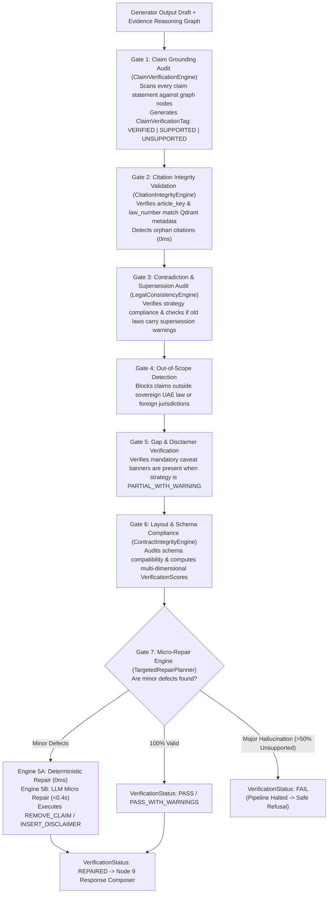

# 🔒 Subsystem Architecture: Verification Engine v1.0 (Node 8)

---

## 📌 Executive Summary & Scope

The **Verification Engine** (`agents/verifier.py`) is Nomos AI's **7-Gate Audit Guardrail**. 

Before any generated legal answer is shown to the user, the Verification Engine audits the draft against the original evidence graph. It enforces a strict **Zero-Hallucination Policy** by evaluating 7 mathematical audit gates:
1. **Gate 1**: Claim Grounding Audit (Verifies every statement against evidence nodes).
2. **Gate 2**: Citation Validation (Validates canonical citations against Qdrant payload metadata).
3. **Gate 3**: Contradiction & Supersession Audit (Ensures repealed laws are flagged as `SUPERSEDED`).
4. **Gate 4**: Out-of-Scope Detection (Blocks claims outside sovereign UAE law).
5. **Gate 5**: Gap & Disclaimer Verification (Ensures required warnings are present).
6. **Gate 6**: Layout & Schema Compliance.
7. **Gate 7**: Micro-Repair Engine (`RepairMode: DETERMINISTIC` or `LLM_MICRO`).

---

## 🔄 Pipeline Node Sequence & Trajectory

```mermaid
flowchart LR
    Node0["Node 0:\nDocument Ingestion"] --> Node1["Node 1:\nPlanner Agent"]
    Node1 --> Node2["Node 2:\nQuery Rewriter"]
    Node2 --> Node3["Node 3:\nQdrant Hybrid Retriever"]
    Node3 --> Node4["Node 4:\nCandidate Grouper"]
    Node4 --> Node5["Node 5:\nReranker Agent"]
    Node5 --> Node6["Node 6:\nRelevance Checker"]
    Node6 --> Node7["Node 7:\nGenerator Engine"]
    Node7 --> Node8["★ Node 8:\nVerification Engine"]
    Node8 --> Node9["Node 9:\nResponse Composer"]
    Node9 --> Node10["Node 10:\nCertification Authority"]
```

- **Predecessor (Upstream)**: **Node 7** ([`Generator.md`](file:///d:/RagnrAI/project_documentation/architecture/Generator.md)) — Generates legal draft with `[CLAIM:node_id]` tags.
- **Current Position**: **Node 8** (Verification Engine) — 7-Gate audit guardrail & Micro-Repair Engine.
- **Successor (Downstream)**: **Node 9** ([`Response_Composer.md`](file:///d:/RagnrAI/project_documentation/architecture/Response_Composer.md)) — Zero-LLM deterministic presentation engine.

---

## 📖 The Intuitive Story: The Supreme Court Appeals Board

Imagine a Supreme Court Appeals Board auditing a legal opinion drafted by a junior clerk:
- Junior Clerk: *"Here is the written draft answer."*
- Appeals Board (**Verification Engine**):
  - *"Sentence 1 claims a penalty of 10,000 AED."*
  - *"Checking Folder 471_1995_78... wait! The text says 5,000 AED, not 10,000 AED!"*
  - *"Action: Trigger **Deterministic Micro-Repair** to fix 10,000 AED $\rightarrow$ 5,000 AED!"*

If the draft contains an un-fixable hallucination, the Appeals Board returns a status of `FAIL` and demands a complete rewrite. If it has a minor error, it auto-repairs it (`VerificationStatus: REPAIRED`).

---

## ⚙️ 1. Verification Audit Pipeline & 7 Audit Gates

---

## 🔍 2. Deep-Dive Specification of the 7 Audit Gates

### 2.1 Gate 1: Claim Grounding Audit (`ClaimVerificationEngine`)
- **Role**: Scans every claim statement generated in the draft and compares it against the `EvidenceReasoningGraph`.
- **Tags Assigned**:
  - `VERIFIED`: 100% matched to graph node with high confidence.
  - `SUPPORTED`: Matched to graph node with medium confidence.
  - `UNSUPPORTED`: Article/claim not present in evidence graph (hallucination).
  - `CONTRADICTED`: Claim contradicts printed evidence text.
- **Formula**:
  $$\text{claim\_grounding\_score} = \frac{\text{Count of Verified + Supported Claims}}{\text{Total Claims}}$$

---

### 2.2 Gate 2: Citation Validation (`CitationIntegrityEngine`)
- **Role**: Deterministically validates that statutory law numbers, years, and article keys (`المادة 78 من القانون 471`) match printed Qdrant payload metadata.
- **Orphan Citation Check**: If a draft cites *"Article 99"*, but Qdrant evidence only contains Articles 78 & 79, Gate 2 flags an `Orphan Citation Error` and deducts citation confidence points.
- **Formula**:
  $$\text{citation\_score} = \max\left(0.0, 1.0 - (\text{Error Count} \times 0.25)\right)$$

---

### 2.3 Gate 3: Contradiction & Supersession Audit (`LegalConsistencyEngine`)
- **Role**: Verifies that if an old version of a law was cited (e.g. 1992 version superseded in 2020), a supersession warning tag is attached.
- **Strategy Auditing**: Verifies that `gen_out.generation_strategy_used` matches the strategy ordered by Node 6 Relevance Checker.

---

### 2.4 Gate 4: Out-of-Scope Detection
- **Role**: Blocks any claim mentioning non-UAE laws, foreign jurisdictions, or out-of-corpus statutory entities.

---

### 2.5 Gate 5: Gap & Disclaimer Verification
- **Role**: Checks if the Relevance Checker requested a warning disclaimer (`PARTIAL_WITH_WARNING`), and verifies that the disclaimer banner is physically present in the draft text.

---

### 2.6 Gate 6: Layout & Schema Compliance (`ContractIntegrityEngine`)
- **Role**: Audits contract version compatibility (`generator_schema_version == "1.1"`) and calculates the composite overall verification score:
- **Formula**:
  $$\text{overall\_score} = 0.40 \cdot \text{grounding} + 0.20 \cdot \text{citation} + 0.20 \cdot \text{consistency} + 0.10 \cdot \text{contract} + 0.10 \cdot \text{warning}$$

---

### 2.7 Gate 7: Micro-Repair Engine (`TargetedRepairPlanner`)
- **Role**: Performs surgical, targeted edits when minor errors or missing disclaimers are detected, avoiding a full LLM regeneration call.

---

## 🛠️ 3. Micro-Repair Engine Actions (`RepairAction`)

When minor defects are detected, the **Micro-Repair Engine** executes 4 specific surgical edit actions (`agents/verifier.py:L317-L356`):

1. **`INSERT_DISCLAIMER`** (Deterministic — 0ms):
   - Automatically prepends missing warning disclaimer banners if a partial evidence disclaimer was omitted.
   - Example text injected: `"- تنبيه: الأدلة المسترجعة تغطي الالتزامات الأساسية ولكنها تفتقر لتغطية كاملة لجميع الاستثناءات."`
2. **`REMOVE_CLAIM`** (LLM Micro — <0.4s):
   - Surgically cuts out any ungrounded claim sentence span without re-writing the rest of the valid answer text.
3. **`REPLACE_CITATION`** (Deterministic — 0ms):
   - Replaces mistyped article keys with verified Qdrant metadata keys.
4. **`FIX_SUPERSESSION`** (Deterministic — 0ms):
   - Injects an explicit supersession warning tag next to repealed statutory clauses.

---

## 📊 4. Verification Status & Failure Taxonomy

| Verification Status | Meaning | Downstream Action |
| :--- | :--- | :--- |
| **`PASS`** | 100% verifiably grounded in evidence graph (`grounding_score = 1.0`). | Direct pass to **Node 9 (Response Composer)**. |
| **`PASS_WITH_WARNINGS`** | Grounded, but carries partial coverage warning. | Appends mandatory caveat banner & passes to Node 9. |
| **`REPAIRED`** | Minor error auto-fixed by Micro-Repair Engine. | Passes auto-repaired clean text to Node 9. |
| **`FAIL`** | Major hallucination ($>50\%$ claims unsupported). | **Halts Pipeline** $\rightarrow$ Blocks response & orders safe refusal. |

### Failure Modes (`VerificationFailureMode`):
- `UNSUPPORTED_CLAIM`: $>50\%$ of generated claims have no backing node in evidence graph.
- `INVALID_CITATION`: Orphan citation cited in draft text does not exist in Qdrant metadata.
- `SUPERSESSION_ERROR`: Repealed law cited without required supersession warning.
- `PIPELINE_CONTRACT_VIOLATION`: Schema version mismatch between Generator and Verifier.
