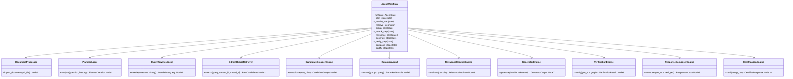

# System Diagrams: Component Relationships & Engine Architecture

## 1. Class & Master Subsystem Engine Dependencies (`Node 0` to `Node 10`)

```mermaid
classDiagram
    class AgentWorkflow {
        +run(state: AgentState)
        +_plan_step(state)
        +_rewrite_step(state)
        +_retrieve_step(state)
        +_group_step(state)
        +_rerank_step(state)
        +_relevance_step(state)
        +_generate_step(state)
        +_verify_step(state)
        +_compose_step(state)
        +_certify_step(state)
    }

    class DocumentProcessor {
        +ingest_document(pdf_file) Node0
    }

    class PlannerAgent {
        +analyze(question, history) PlannerDecision Node1
    }

    class QueryRewriterAgent {
        +rewrite(question, history) StandaloneQuery Node2
    }

    class QdrantHybridRetriever {
        +search(query, tenant_id, thread_id) RawCandidates Node3
    }

    class CandidateGrouperEngine {
        +consolidate(raw_hits) CandidateGroups Node4
    }

    class RerankerAgent {
        +rerank(groups, query) RerankedBundle Node5
    }

    class RelevanceCheckerEngine {
        +evaluate(bundle) RelevanceDecision Node6
    }

    class GeneratorEngine {
        +generate(bundle, relevance) GeneratorOutput Node7
    }

    class VerificationEngine {
        +verify(gen_out, graph) VerificationResult Node8
    }

    class ResponseComposerEngine {
        +compose(gen_out, verif_res) ResponseOutput Node9
    }

    class CertificationEngine {
        +certify(resp_out) CertifiedResponse Node10
    }

    AgentWorkflow --> DocumentProcessor
    AgentWorkflow --> PlannerAgent
    AgentWorkflow --> QueryRewriterAgent
    AgentWorkflow --> QdrantHybridRetriever
    AgentWorkflow --> CandidateGrouperEngine
    AgentWorkflow --> RerankerAgent
    AgentWorkflow --> RelevanceCheckerEngine
    AgentWorkflow --> GeneratorEngine
    AgentWorkflow --> VerificationEngine
    AgentWorkflow --> ResponseComposerEngine
    AgentWorkflow --> CertificationEngine
```
