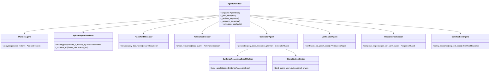

# System Diagrams: Component Relationships

## 1. Class & Engine Dependencies

```mermaid
classDiagram
    class AgentWorkflow {
        +run(state: AgentState)
        +_plan_step(state)
        +_retrieve_step(state)
        +_research_step(state)
        +_verification_step(state)
    }

    class PlannerAgent {
        +analyze(question, history) PlannerDecision
    }

    class QdrantHybridRetriever {
        +search(query, tenant_id, thread_id) List~Document~
        -_combine_rrf(dense_hits, sparse_hits)
    }

    class FlashRankReranker {
        +rerank(query, documents) List~Document~
    }

    class RelevanceChecker {
        +check_relevance(docs, query) RelevanceDecision
    }

    class GeneratorAgent {
        +generate(query, docs, relevance, planner) GeneratorOutput
    }

    class EvidenceReasoningGraphBuilder {
        +build_graph(docs) EvidenceReasoningGraph
    }

    class ClaimCitationBinder {
        +bind_claims_and_citations(draft, graph)
    }

    class VerificationAgent {
        +verify(gen_out, graph, docs) VerificationReport
    }

    class ResponseComposer {
        +compose_response(gen_out, verif_report) ResponseOutput
    }

    class CertificationEngine {
        +certify_response(resp_out, docs) CertifiedResponse
    }

    AgentWorkflow --> PlannerAgent
    AgentWorkflow --> QdrantHybridRetriever
    AgentWorkflow --> FlashRankReranker
    AgentWorkflow --> RelevanceChecker
    AgentWorkflow --> GeneratorAgent
    AgentWorkflow --> VerificationAgent
    AgentWorkflow --> ResponseComposer
    AgentWorkflow --> CertificationEngine

    GeneratorAgent --> EvidenceReasoningGraphBuilder
    GeneratorAgent --> ClaimCitationBinder
```
