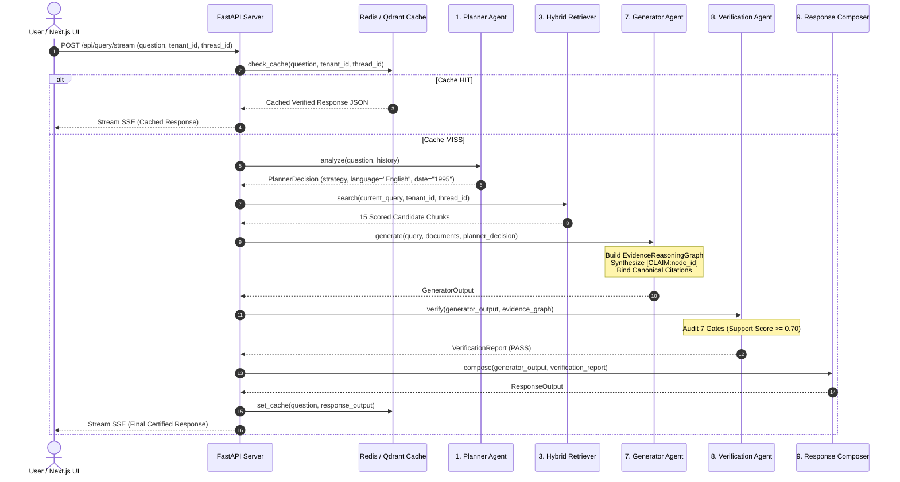

# System Diagrams: Data Flow Sequences

## 1. End-to-End Query Sequence Diagram

```mermaid
sequenceDiagram
    autonumber
    actor User as User / Next.js UI
    participant API as FastAPI Server
    participant Cache as Redis / Qdrant Cache
    participant Planner as 1. Planner Agent
    participant Retriever as 3. Hybrid Retriever
    participant Generator as 7. Generator Agent
    participant Verifier as 8. Verification Agent
    participant Composer as 9. Response Composer

    User->>API: POST /api/query/stream (question, tenant_id, thread_id)
    API->>Cache: check_cache(question, tenant_id, thread_id)
    alt Cache HIT
        Cache-->>API: Cached Verified Response JSON
        API-->>User: Stream SSE (Cached Response)
    else Cache MISS
        API->>Planner: analyze(question, history)
        Planner-->>API: PlannerDecision (strategy, language="English", date="1995")
        API->>Retriever: search(current_query, tenant_id, thread_id)
        Retriever-->>API: 15 Scored Candidate Chunks
        API->>Generator: generate(query, documents, planner_decision)
        Note over Generator: Build EvidenceReasoningGraph<br/>Synthesize [CLAIM:node_id]<br/>Bind Canonical Citations
        Generator-->>API: GeneratorOutput
        API->>Verifier: verify(generator_output, evidence_graph)
        Note over Verifier: Audit 7 Gates (Support Score >= 0.70)
        Verifier-->>API: VerificationReport (PASS)
        API->>Composer: compose(generator_output, verification_report)
        Composer-->>API: ResponseOutput
        API->>Cache: set_cache(question, response_output)
        API-->>User: Stream SSE (Final Certified Response)
    end
```
