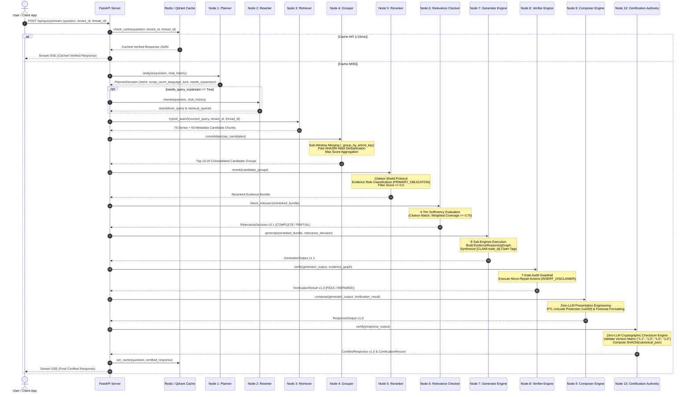

# System Diagrams: Data Flow Sequences

## 1. Master Nomos AI 11-Node Sequence Diagram

```mermaid
sequenceDiagram
    autonumber
    actor User as User / Client App
    participant API as FastAPI Server
    participant Cache as Redis / Qdrant Cache
    participant Node1 as Node 1: Planner
    participant Node2 as Node 2: Rewriter
    participant Node3 as Node 3: Retriever
    participant Node4 as Node 4: Grouper
    participant Node5 as Node 5: Reranker
    participant Node6 as Node 6: Relevance Checker
    participant Node7 as Node 7: Generator Engine
    participant Node8 as Node 8: Verifier Engine
    participant Node9 as Node 9: Composer Engine
    participant Node10 as Node 10: Certification Authority

    User->>API: POST /api/query/stream (question, tenant_id, thread_id)
    API->>Cache: check_cache(question, tenant_id, thread_id)
    alt Cache HIT (<15ms)
        Cache-->>API: Cached Verified Response JSON
        API-->>User: Stream SSE (Cached Verified Response)
    else Cache MISS
        API->>Node1: analyze(question, chat_history)
        Node1-->>API: PlannerDecision (intent, script_count_language_lock, needs_expansion)
        opt needs_query_expansion == True
            API->>Node2: rewrite(question, chat_history)
            Node2-->>API: standalone_query & retrieval_queries
        end
        API->>Node3: hybrid_search(current_query, tenant_id, thread_id)
        Node3-->>API: 75 Dense + 50 Metadata Candidate Chunks
        API->>Node4: consolidate(raw_candidates)
        Note over Node4: Sub-Window Merging (_group_by_article_key)<br/>Fast SHA256 Hash Deduplication<br/>Max Score Aggregation
        Node4-->>API: Top 15-20 Consolidated Candidate Groups
        API->>Node5: rerank(candidate_groups)
        Note over Node5: Citation Shield Protocol<br/>Evidence Role Classification (PRIMARY_OBLIGATION)<br/>Filter Score >= 0.0
        Node5-->>API: Reranked Evidence Bundle
        API->>Node6: check_relevance(reranked_bundle)
        Note over Node6: 4-Tier Sufficiency Evaluation<br/>(Citation Match, Weighted Coverage >= 0.70)
        Node6-->>API: RelevanceDecision v3.1 (COMPLETE / PARTIAL)
        API->>Node7: generate(reranked_bundle, relevance_decision)
        Note over Node7: 5 Sub-Engines Execution<br/>Build EvidenceReasoningGraph<br/>Synthesize [CLAIM:node_id] Claim Tags
        Node7-->>API: GeneratorOutput v1.1
        API->>Node8: verify(generator_output, evidence_graph)
        Note over Node8: 7-Gate Audit Guardrail<br/>Execute Micro-Repair Actions (INSERT_DISCLAIMER)
        Node8-->>API: VerificationResult v1.0 (PASS / REPAIRED)
        API->>Node9: compose(generator_output, verification_result)
        Note over Node9: Zero-LLM Presentation Engineering<br/>RTL Unicode Protection (\u200f) & Footnote Formatting
        Node9-->>API: ResponseOutput v1.0
        API->>Node10: certify(response_output)
        Note over Node10: Zero-LLM Cryptographic Checksum Engine<br/>Validate Version Matrix ("1.1", "1.0", "1.0", "1.0")<br/>Compute SHA256(canonical_json)
        Node10-->>API: CertifiedResponse v1.0 & CertificationRecord
        API->>Cache: set_cache(question, certified_response)
        API-->>User: Stream SSE (Final Certified Response)
    end
```
