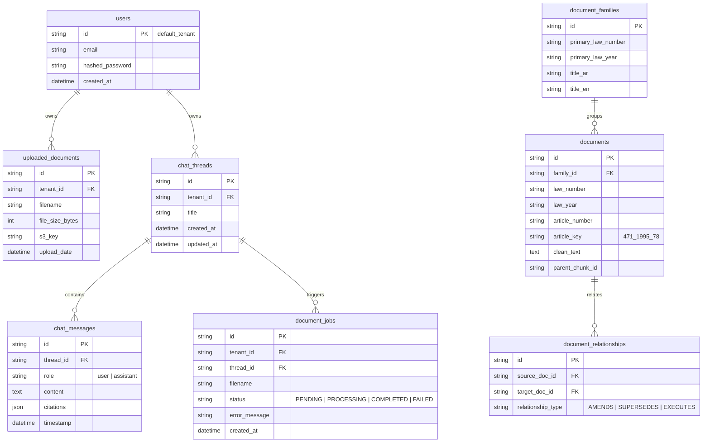

# Database Design: Relational Schemas & Vector Payloads

## 1. PostgreSQL Relational Schema (`db/models.py`)

### ER Diagram



---

## 2. Qdrant Vector Collection Payload Schema (`ragnr_documents`)

Each point in the Qdrant `ragnr_documents` collection contains dual vector embeddings and structured payload attributes:

```json
{
  "id": "e8c6f36d-eefb-4a66-b126-5888ae0dcb52",
  "vector": {
    "text-dense": [0.0124, -0.0452, 0.0891, "... (1024 float dimensions)"],
    "text-sparse": {
      "indices": [1024, 4096, 8192, 12288],
      "values": [0.85, 1.42, 0.63, 1.15]
    }
  },
  "payload": {
    "text": "( الماده 78 ) تسري الاحكام السابقه علي منتسبي المدارس والكليات الخاصه من المسجونين بعد موافقه مدير المنشاه العقابيه .",
    "tenant_id": "default_tenant",
    "thread_id": "8dcde63c-1745-4464-b0ec-c3547d61de12",
    "source": "قرار وزاري رقم (471) لسنة 1995م بإصدار اللائحة التنفيذية بالقانون الاتحادي رقم (43) لسنة 1992م في شأن تنظيم المنشآت العقابية.pdf",
    "article": "78",
    "law_number": "471",
    "law_year": "1995",
    "article_key": "471_1995_78",
    "parent_chunk_id": null
  }
}
```

---

## 3. Redis & Qdrant Cache Schemas

### Redis Exact Cache Key Format
- `exact_cache:{tenant_id}:{thread_id}:v{version}:{SHA256(query)}`
- TTL: 86,400 seconds (24 Hours).

### Qdrant Semantic Cache Vector Payload
- Collection Name: `semantic_cache`
- Vector: 1024d Dense BGE-M3 Query Embedding.
- Similarity Match Threshold: $\ge 0.96$.
