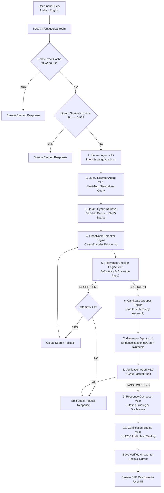

# System Diagrams: RAG Pipeline Flowcharts

## 1. Complete LangGraph Agentic Pipeline

```mermaid
flowchart TD
    UserQuery[User Input Query\nArabic / English] --> API[FastAPI /api/query/stream]
    API --> ExactCacheCheck{Redis Exact Cache\nSHA256 Hit?}
    
    ExactCacheCheck -- YES --> ReturnExact[Stream Cached Response]
    ExactCacheCheck -- NO --> SemanticCacheCheck{Qdrant Semantic Cache\nSim >= 0.96?}
    
    SemanticCacheCheck -- YES --> ReturnSemantic[Stream Cached Response]
    SemanticCacheCheck -- NO --> Node1[1. Planner Agent v1.2\nIntent & Language Lock]
    
    Node1 --> Node2[2. Query Rewriter Agent v1.1\nMulti-Turn Standalone Query]
    Node2 --> Node3[3. Qdrant Hybrid Retriever\nBGE-M3 Dense + BM25 Sparse]
    Node3 --> Node4[4. FlashRank Reranker Engine\nCross-Encoder Re-scoring]
    Node4 --> Node5[5. Relevance Checker Engine v3.1\nSufficiency & Coverage Pass?]
    
    Node5 -- INSUFFICIENT --> FallbackCheck{Attempts < 1?}
    FallbackCheck -- YES --> GlobalSearch[Global Search Fallback] --> Node4
    FallbackCheck -- NO --> Refusal[Emit Legal Refusal Response]
    
    Node5 -- SUFFICIENT --> Node6[6. Candidate Grouper Engine\nStatutory Hierarchy Assembly]
    Node6 --> Node7[7. Generator Agent v1.1\nEvidenceReasoningGraph Synthesis]
    Node7 --> Node8[8. Verification Agent v1.0\n7-Gate Factual Audit]
    
    Node8 -- PASS / WARNING --> Node9[9. Response Composer v1.0\nCitation Binding & Disclaimers]
    Node8 -- FAIL --> Refusal
    
    Node9 --> Node10[10. Certification Engine v1.0\nSHA256 Audit Hash Sealing]
    Node10 --> SaveCache[Save Verified Answer to Redis & Qdrant]
    SaveCache --> StreamResponse[Stream SSE Response to User UI]
```
